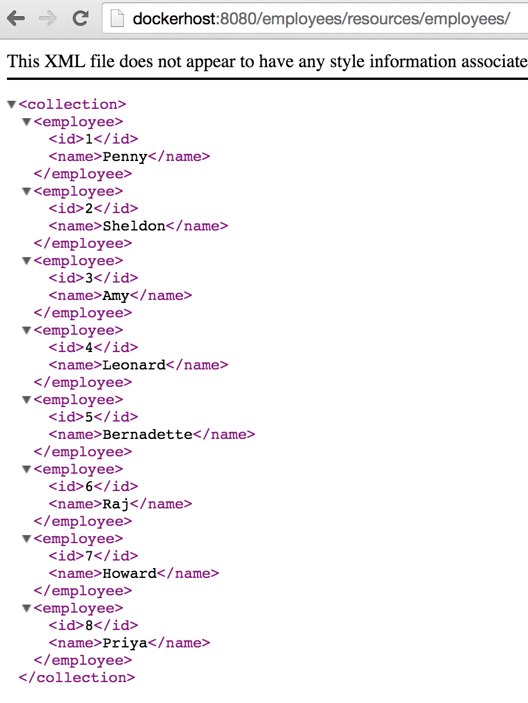

## Multiple Containers Using Docker Compose

[quote, github.com/docker/compose]
Docker Compose is a tool for defining and running complex applications with Docker. With Compose, you define a multi-container application in a single file, then spin your application up in a single command which does everything that needs to be done to get it running.

An application using Docker containers will typically consist of multiple containers. With Docker Compose, there is no need to write shell scripts to start your containers. All the containers are defined in a configuration file using _services_, and then `docker-compose` script is used to start, stop, and restart the application and all the services in that application, and all the containers within that service. The complete list of commands is:

[options="header"]
|====
| Command | Purpose
| `build` | Build or rebuild services
| `help` | Get help on a command
| `kill` | Kill containers
| `logs` | View output from containers
| `port` | Print the public port for a port binding
| `ps` | List containers
| `pull` | Pulls service images
| `restart` | Restart services
| `rm` | Remove stopped containers
| `run` | Run a one-off command
| `scale` | Set number of containers for a service
| `start` | Start services
| `stop` | Stop services
| `up` | Create and start containers
| `migrate-to-labels  Recreate containers to add labels
|====

Docker Compose script is only available for OSX and Linux. https://github.com/arun-gupta/docker-java/issues/3 is used for tracking Docker Compose on Windows.

### Configuration File

. Entry point to Compose is `docker-compose.yml`. Lets use the following file:
+
[source, yml]
----
mysqldb:
  image: dockerhost:5000/mysql
  environment:
    MYSQL_DATABASE: sample
    MYSQL_USER: mysql
    MYSQL_PASSWORD: mysql
    MYSQL_ROOT_PASSWORD: supersecret
mywildfly:
  image: dockerhost:5000/arungupta/wildfly-mysql-javaee7
  links:
    - mysqldb:db
  ports:
    - 8080:8080
----
+
This file is available in link:../attendees/docker-compose.yml[] and shows:
+
.. Two services are defined by the name `mysqldb` and `mywildfly`
.. Image name for each service is defined using `image`
.. Environment variables for the MySQL container are defined in `environment`
.. MySQL container is linked with WildFly container using `links`
.. Port forwarding is achieved using `ports`

### Start Services

. All the services can be started, in detached mode, by giving the command:
+
  docker-compose up -d
+
And this shows the output as:
+
  Creating attendees_mysqldb_1...
  Creating attendees_mywildfly_1...
+
An alternate compose file name can be specified using `-f`.
+
An alternate directory where the compose file exists can be specified using `-p`.
+
. Started services can be verified as:
+
[source, text]
----
> docker-compose ps
        Name                       Command               State                Ports               
-------------------------------------------------------------------------------------------------
attendees_mysqldb_1     /entrypoint.sh mysqld            Up      3306/tcp                         
attendees_mywildfly_1   /opt/jboss/wildfly/customi ...   Up      0.0.0.0:8080->8080/tcp, 9990/tcp 
----
+
This provides a consolidated view of all the services started, and containers within them.
+
Alternatively, the containers in this application, and any additional containers running on this Docker host can be verified by using the usual `docker ps` command:
+
[source, text]
----
> docker ps
CONTAINER ID        IMAGE                                    COMMAND                CREATED             STATUS              PORTS                              NAMES
3598e545bd2f        arungupta/wildfly-mysql-javaee7:latest   "/opt/jboss/wildfly/   59 seconds ago      Up 58 seconds       0.0.0.0:8080->8080/tcp, 9990/tcp   attendees_mywildfly_1   
b8cf6a3d518b        mysql:latest                             "/entrypoint.sh mysq   2 minutes ago       Up 2 minutes        3306/tcp                           attendees_mysqldb_1  
----
+
. Service logs can be seen as:
+
[source, text]
----
> docker-compose logs
Attaching to attendees_mywildfly_1, attendees_mysqldb_1
mywildfly_1 | => Starting WildFly server
mywildfly_1 | => Waiting for the server to boot
mywildfly_1 | =========================================================================
mywildfly_1 | 
mywildfly_1 |   JBoss Bootstrap Environment
mywildfly_1 | 
mywildfly_1 |   JBOSS_HOME: /opt/jboss/wildfly
mywildfly_1 | 
mywildfly_1 |   JAVA: /usr/lib/jvm/java/bin/java
mywildfly_1 | 
mywildfly_1 |   JAVA_OPTS:  -server -Xms64m -Xmx512m -XX:MaxPermSize=256m -Djava.net.preferIPv4Stack=true -Djboss.modules.system.pkgs=org.jboss.byteman -Djava.awt.headless=true
mywildfly_1 | 

. . .

mywildfly_1 | 15:40:20,866 INFO  [org.jboss.resteasy.spi.ResteasyDeployment] (MSC service thread 1-2) Deploying javax.ws.rs.core.Application: class org.javaee7.samples.employees.MyApplication
mywildfly_1 | 15:40:20,914 INFO  [org.wildfly.extension.undertow] (MSC service thread 1-2) JBAS017534: Registered web context: /employees
mywildfly_1 | 15:40:21,032 INFO  [org.jboss.as.server] (ServerService Thread Pool -- 28) JBAS018559: Deployed "employees.war" (runtime-name : "employees.war")
mywildfly_1 | 15:40:21,077 INFO  [org.jboss.as] (Controller Boot Thread) JBAS015961: Http management interface listening on http://127.0.0.1:9990/management
mywildfly_1 | 15:40:21,077 INFO  [org.jboss.as] (Controller Boot Thread) JBAS015951: Admin console listening on http://127.0.0.1:9990
mywildfly_1 | 15:40:21,077 INFO  [org.jboss.as] (Controller Boot Thread) JBAS015874: WildFly 8.2.0.Final "Tweek" started in 9572ms - Started 280 of 334 services (92 services are lazy, passive or on-demand)
mysqldb_1   | Running mysql_install_db
mysqldb_1   | 2015-06-05 15:38:31 0 [Note] /usr/sbin/mysqld (mysqld 5.6.25) starting as process 27 ...
mysqldb_1   | 2015-06-05 15:38:31 27 [Note] InnoDB: Using atomics to ref count buffer pool pages

. . .

mysqldb_1   | 2015-06-05 15:38:40 1 [Note] Event Scheduler: Loaded 0 events
mysqldb_1   | 2015-06-05 15:38:40 1 [Note] mysqld: ready for connections.
mysqldb_1   | Version: '5.6.25'  socket: '/var/run/mysqld/mysqld.sock'  port: 3306  MySQL Community Server (GPL)
mysqldb_1   | 2015-06-05 15:40:18 1 [Warning] IP address '172.17.0.24' could not be resolved: Name or service not known
----

### Verify Application

. Access the application at http://dockerhost:8080/employees/resources/employees/. This is shown in the browser as:

.Output From Servers Run Using Docker Compose

### Stop Services

. Stop the services as:
+
[source, text]
----
> docker-compose stop
Stopping attendees_mywildfly_1...
Stopping attendees_mysqldb_1...
----

### Scale Services

https://github.com/arun-gupta/docker-java/issues/51

