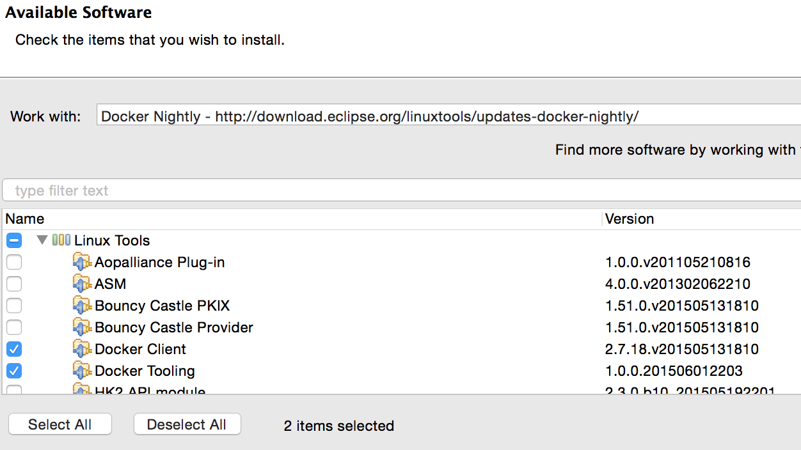
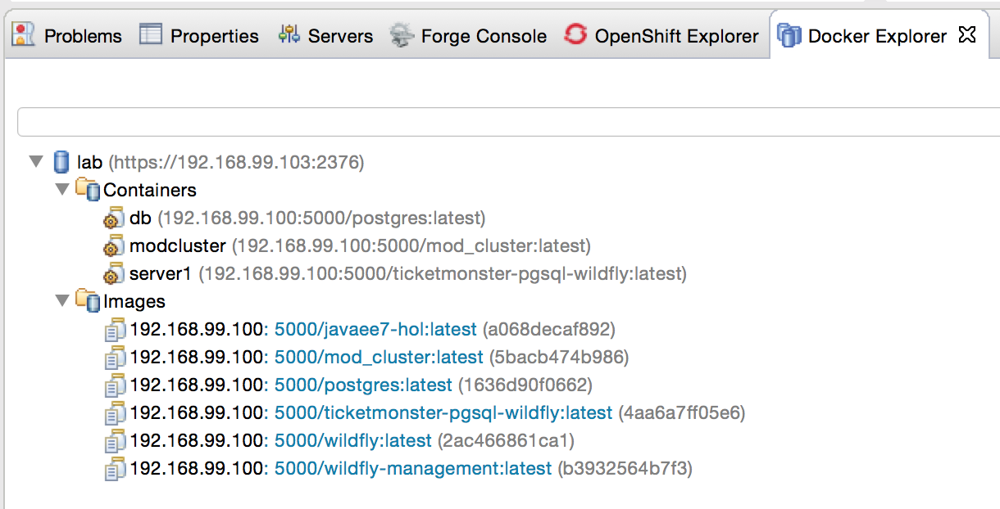
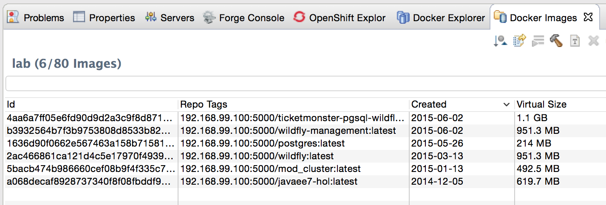
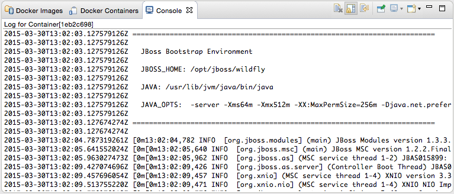
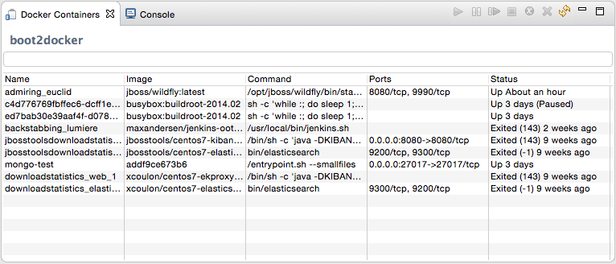

The Docker tooling is aimed at providing at minimum the same basic level features as the command-line interface, but also provide some advantages by having access to a full fledged UI.

### Install Docker Tools Plugins

As this is still in early access stage, you will have to install it first:

. Download and Install https://devstudio.redhat.com/9.0/snapshots/builds/devstudio.product_master/latest/installer/[JBoss Developer Studio 9.0 Nightly], take defaults through out the installation. 
+
Alternatively, download http://www.eclipse.org/downloads/index-developer-default.php[Eclipse Mars latest build] and configure JBoss Tools plugin from the update site http://download.jboss.org/jbosstools/updates/nightly/mars/.
+
. Open JBoss Developer Studio 9.0 Nightly
. Add a new site using the menu items: ``Help'' > ``Install New Software...'' > ``Add...''. Specify the ``Name:'' as ``Docker Nightly'' and ``Location:'' as http://download.eclipse.org/linuxtools/updates-docker-nightly/.
+
.Add Docker Tooling To JBoss Developer Studio
image::../images/jbds-docker-tools1.png[]
+
. Expand Linux Tools, select ``Docker Client'' and ``Docker Tooling''.
+
.Add Docker Tooling

+
. Click on ``Next >'', ``Next >'', accept the terms of the license agreement, and click on ``Finish''. This will complete the installation of plugins.
+
Restart the IDE for the changes to take effect.

### Docker Explorer

The Docker Explorer provides a wizard to establish a new connection to a Docker daemon. This wizard can detect default settings if the user’s machine runs Docker natively (such as in Linux) or in a VM using Boot2Docker (such as in Mac or Windows). Both Unix sockets on Linux machines and the REST API on other OSes are detected and supported. The wizard also allows remote connections using custom settings.

. Use the menu ``Window'', ``Show View'', ``Other...''. Type ``docker'' to see the output as:
+
image::../images/jbds-docker-tools-docker-view.png[]
+
. Select ``Docker Explorer'' to open Docker Explorer.
+
image::../images/jbds-docker-tools-docker-explorer-view.png[]
+
. Click on the link in this window to create a connection to Docker Host. Specify the settings as shown:
+
.Docker Explorer
image::../images/jbds-docker-tools2.png[]
+
Make sure to get IP address of the Docker Host as:
+
[source, text]
----
docker-machine ip lab
----
+
Also, make sure to specify the correct directory for `.docker` on your machine.
+
. Click on ``Test Connection'' to check the connection. This should show the output as:
+
.Docker Explorer
image::../images/jbds-docker-tools-test-connection-output.png[]
+
Click on ``OK'' and ``Finish'' to exit out of the wizard.
+
. Docker Explorer itself is a tree view that handles multiple connections and provides users with quick overview of the existing images and containers.
+
.Docker Explorer Tree View

+
. Customize the view by clicking on the arrow in toolbar:
+
.Docker Explorer Customize View
image::../images/jbds-docker-tools-customize-view-option.png[]
+
Built-in filters can show/hide intermediate and `dangling' images, as well as stopped containers.
+
.Docker Explorer Customize View Wizard
image::../images/jbds-docker-tools-customize-view-wizard.png[]

### Docker Images

The Docker Images view lists all images in the Docker host selected in the Docker Explorer view. This view allows user to manage images, including:

. Pull/push images from/to the Docker Hub Registry (other registries will be supported as well, https://bugs.eclipse.org/bugs/show_bug.cgi?id=469306[#469306])
. Build images from a Dockerfile
. Create a container from an image

Lets take a look at it.

. Use the menu ``Window'', ``Show View'', ``Other...'', select ``Docker Images''. It shows the list of images on Docker Host:
+
.Docker Images View

+
. Right-click on the image ending with ``wildfly:latest'' and click on the green arrow in the toolbar. This will show the following wizard:
+
.Docker Run Container Wizard
image::../images/jbds-docker-tools-run-container-wizard.png[]
+
By default, all exports ports from the image are mapped to random ports on the host interface. This setting can be changed by unselecting the first checkbox and specify exact port mapping.
+
Click on ``Finish'' to start the container.
+
. When the container is started, all logs are streamed into Eclipse Console:
+
.Docker Container Logs

### Docker Containers

Docker Containers view lets the user manage the containers. The view toolbar provides commands to start, stop, pause, unpause, display the logs and kill containers.

. Use the menu ``Window'', ``Show View'', ``Other...'', select ``Docker Containers''. It shows the list of running containers on Docker Host:
+
.Docker Containers View

+ 
. Pause the container by clicking on the ``pause'' button in the toolbar (https://bugs.eclipse.org/bugs/show_bug.cgi?id=469310[#469310]). Show the complete list of containers by clicking on the ``View Menu'', ``Show all containers''.
+
.All Docker Containers
image::../images/jbds-docker-tools-all-containers.png[]
+
. Select the paused container, and click on the green arrow in the toolbar to restart the container.
. Right-click on any running container and select ``Display Log'' to view the log for this container.
+
.Eclipse Properties View
image::../images/jbds-docker-tools-display-log.png[]

TODO: Users can also attach an Eclipse console to a running Docker container to follow the logs and use the STDIN to interact with it.

### Information and Inspect on Images and Containers

Eclipse Properties view is used to provide more information about the containers and images.

. Just open the Properties View and click on a Connection, Container, or Image in any of the Docker Explorer View, Docker Containers View, or Docker Images View. This will fill in data in the Properties view.
+
Info view is shown as:
+
.Docker Container Properties View Info
image::../images/jbds-docker-tools-properties-info.png[]
+
Inspect view is shown as:
+
.Docker Container Properties View Inspect
image::../images/jbds-docker-tools-properties-inspect.png[]