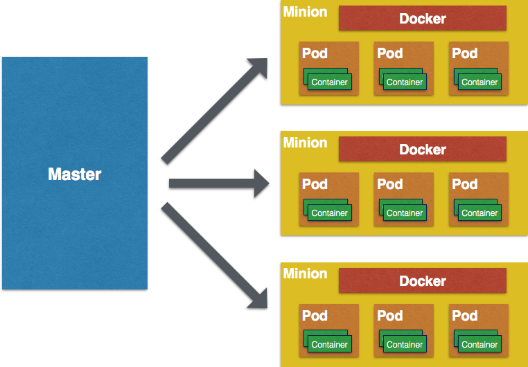
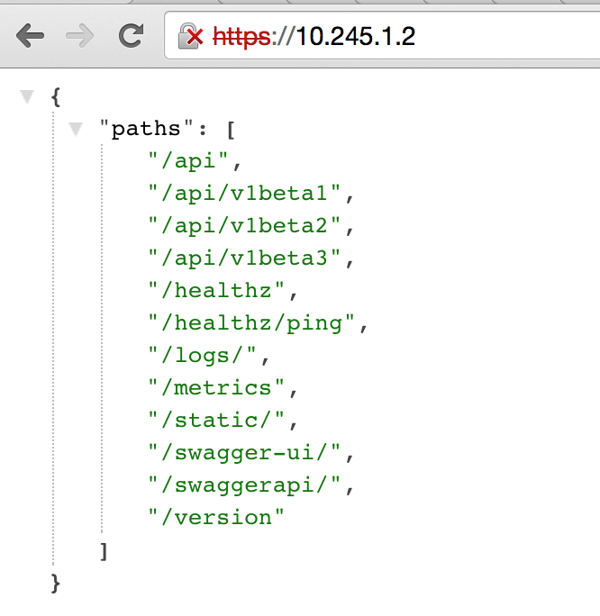
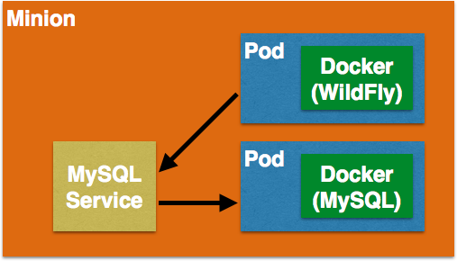

## Java EE Application on Kubernetes Cluster

[quote, github.com/GoogleCloudPlatform/kubernetes/]
Kubernetes is an open source system for managing containerized applications across multiple hosts, providing basic mechanisms for deployment, maintenance, and scaling of applications.

Kubernetes, or ``k8s'' in short, allows the user to provide declarative primitives for the desired state, for example “need 5 WildFly servers and 1 MySQL server running”. Kubernetes self-healing mechanisms, such as auto-restarting, re-scheduling, and replicating containers then ensure this state is met. The user just define the state and Kubernetes ensures that the state is met at all times on the cluster.

*How is it related to Docker?*

Docker provides the lifecycle management of containers. A Docker image defines a build time representation of the runtime containers. There are commands to start, stop, restart, link, and perform other lifecycle methods on these containers. Kubernetes uses Docker to package, instantiate, and run containerized applications.

*How does Kubernetes simplify containerized application deployment?*

A typical application would have a cluster of containers across multiple hosts. For example, your web tier (for example Undertow) might run on a set of containers. Similarly, your application tier (for example, WildFly) would run on a different set of containers. The web tier would need to delegate the request to application tier. In some cases, or at least to begin with, you may have your web and application server packaged together in the same set of containers. The database tier would generally run on a separate tier anyway. These containers would need to talk to each other. Using any of the solutions mentioned above would require scripting to start the containers, and monitoring/bouncing if something goes down. Kubernetes does all of that for the user after the application state has been defined.

### Key Concepts

At a very high level, there are three key concepts:

. *Pods* are the smallest deployable units that can be created, scheduled, and managed. Its a logical collection of containers that belong to an application.
. *Master* is the central control point that provides a unified view of the cluster. There is a single master node that control multiple minions.
. *Minion* is a worker node that run tasks as delegated by the master. Minions can run one or more pods. It provides an application-specific “virtual host” in a containerized environment.

A picture is always worth a thousand words and so this is a high-level logical block diagram for Kubernetes:

.Kubernetes Key Concepts

After the 50,000 feet view, lets fly a little lower at 30,000 feet and take a look at how Kubernetes make all of this happen. There are a few key components at Master and Minion that make this happen.

. *Replication Controller* is a resource at Master that ensures that requested number of pods are running on minions at all times.
. *Service* is an object on master that provides load balancing across a replicated group of pods.
Label is an arbitrary key/value pair in a distributed watchable storage that the Replication Controller uses for service discovery.
. *Kubelet* Each minion runs services to run containers and be managed from the master. In addition to Docker, Kubelet is another key service installed there. It reads container manifests as YAML files that describes a pod. Kubelet ensures that the containers defined in the pods are started and continue running.
. Master serves *RESTful Kubernetes API* that validate and configure Pod, Service, and Replication Controller.

### Start Kubernetes Cluster

. Download Kubernetes from http://dockerlab:8082/kubernetes.tar.gz (version 0.18.1.1)
. Setup a cluster as:
+
[source, text]
----
cd kubernetes

export KUBERNETES_PROVIDER=vagrant
./cluster/kube-up.sh
----
+
The `KUBERNETES_PROVIDER` environment variable tells all of the various cluster management scripts which variant to use.
+
NOTE: This will take a few minutes, so be patience! Vagrant will provision each machine in the cluster with all the necessary components to run Kubernetes.
+
It shows the output as:
+
[source, text]
----
Starting cluster using provider: vagrant
... calling verify-prereqs
... calling kube-up
Using credentials: vagrant:vagrant

. . .

Cluster validation succeeded
Done, listing cluster services:

Kubernetes master is running at https://10.245.1.2
KubeDNS is running at https://10.245.1.2/api/v1beta3/proxy/namespaces/default/services/kube-dns
----
+
Note down the address for Kubernetes master, `https://10.245.1.2` in this case.
+
. Verify the Kubernetes cluster as:
+
[source, text]
----
kubernetes> vagrant status
Current machine states:

master                    running (virtualbox)
minion-1                  running (virtualbox)

This environment represents multiple VMs. The VMs are all listed
above with their current state. For more information about a specific
VM, run `vagrant status NAME`.
----
+
By default, the Vagrant setup will create a single kubernetes-master and 1 kubernetes-minion. Each VM will take 1 GB, so make sure you have at least 2GB to 4GB of free memory (plus appropriate free disk space).
+
NOTE: By default, only one minion is created. This can be manipulated by setting an environment variable NUM_MINIONS variable to an integer before invoking `kube-up.sh` script.
+
By default, each VM in the cluster is running Fedora, Kubelet is installed into ``systemd'', and all other Kubernetes services are running as containers on Master.
+
. Access https://10.245.1.2 (or whatever IP address is assigned to your kubernetes cluster start up log). This may present the warning as shown below:
+
image::../images/kubernetes-master-default-output-certificate.png[]
+
Click on ``Advanced'' and then on ``Proceed to 10.245.1.2'' to see the output as:
+
.Kubernetes Output from Master

+
Use ``vagrant'' as the username and ``vagrant'' as the password.
+
Check the list of nodes as:
+
[source, text]
----
> ./cluster/kubectl.sh get nodes
NAME         LABELS                              STATUS
10.245.1.3   kubernetes.io/hostname=10.245.1.3   Ready
----
+
. Check the list of pods:
+
[source, text]
----
> ./cluster/kubectl.sh get nodes
NAME         LABELS                              STATUS
10.245.1.3   kubernetes.io/hostname=10.245.1.3   Ready
kubernetes> ./cluster/kubectl.sh get po
POD                                IP           CONTAINER(S)     IMAGE(S)                                                                   HOST                    LABELS                                                           STATUS    CREATED     MESSAGE
kube-dns-v1-jnvez                  172.17.0.2                                                                                               10.245.1.3/10.245.1.3   k8s-app=kube-dns,kubernetes.io/cluster-service=true,version=v1   Running   6 minutes   
                                                skydns           gcr.io/google_containers/skydns:2015-03-11-001                                                                                                                      Running   4 minutes   last termination: exit code 2
                                                kube2sky         gcr.io/google_containers/kube2sky:1.7                                                                                                                               Running   4 minutes   
                                                etcd             gcr.io/google_containers/etcd:2.0.9                                                                                                                                 Running   5 minutes   
kube-scheduler-kubernetes-master                                                                                                            kubernetes-master/      <none>                                                           Pending   2 seconds   
                                                kube-scheduler   gcr.io/google_containers/kube-scheduler:d1f640dfb379f64daf3ae44286014821                                                                                                                  
----
+
. Check the list of services running:
+
[source, text]
----
> ./cluster/kubectl.sh get se
NAME            LABELS                                                                           SELECTOR           IP(S)         PORT(S)
kube-dns        k8s-app=kube-dns,kubernetes.io/cluster-service=true,kubernetes.io/name=KubeDNS   k8s-app=kube-dns   10.247.0.10   53/UDP
                                                                                                                                  53/TCP
kubernetes      component=apiserver,provider=kubernetes                                          <none>             10.247.0.2    443/TCP
kubernetes-ro   component=apiserver,provider=kubernetes                                          <none>             10.247.0.1    80/TCP
----
+
. Check the list of replication controllers:
+
[source, text]
----
> ./cluster/kubectl.sh get rc
CONTROLLER    CONTAINER(S)   IMAGE(S)                                         SELECTOR                      REPLICAS
kube-dns-v1   etcd           gcr.io/google_containers/etcd:2.0.9              k8s-app=kube-dns,version=v1   1
              kube2sky       gcr.io/google_containers/kube2sky:1.7                                          
              skydns         gcr.io/google_containers/skydns:2015-03-11-001
----

### Deploy Java EE Application

Pods, and the IP addresses assigned to them, are ephemeral. If a pod dies then Kubernetes will recreate that pod because of its self-healing features, but it might recreate it on a different host. Even if it is on the same host, a different IP address could be assigned to it. And so any application cannot rely upon the IP address of the pod.

Kubernetes services is an abstraction which defines a logical set of pods. A service is typically back-ended by one or more physical pods (associated using labels), and it has a permanent IP address that can be used by other pods/applications. For example, WildFly pod can not directly connect to a MySQL pod but can connect to MySQL service. In essence, Kubernetes service offers clients an IP and port pair which, when accessed, redirects to the appropriate backends.

.Kubernetes Services

NOTE: In this case, all the pods are running on a single minion. This is because, that is the default number for a Kubernetes cluster. The pod can very be on another minion if more minions exist in the cluster.

Any Service that a Pod wants to access must be created before the Pod itself, or else the environment variables will not be populated.

#### Start MySQL Service

. Start MySQL service as:
+
[source, text]
----
./cluster/kubectl.sh create -f ../../attendees/kubernetes/mysql-service.yaml
----
+
. Check that the service is created:
+
[source, text]
----
> ./cluster/kubectl.sh get se
NAME            LABELS                                                                           SELECTOR           IP(S)          PORT(S)
kube-dns        k8s-app=kube-dns,kubernetes.io/cluster-service=true,kubernetes.io/name=KubeDNS   k8s-app=kube-dns   10.247.0.10    53/UDP
                                                                                                                                   53/TCP
kubernetes      component=apiserver,provider=kubernetes                                          <none>             10.247.0.2     443/TCP
kubernetes-ro   component=apiserver,provider=kubernetes                                          <none>             10.247.0.1     80/TCP
mysql           name=mysql                                                                       name=mysql         10.247.82.83   3306/TCP
----
+
. When a Pod is run on a node, the kubelet adds a set of environment variables for each active Service. 
+
It supports both Docker links compatible variables and simpler `{SVCNAME}_SERVICE_HOST` and `{SVCNAME}_SERVICE_PORT` variables, where the Service name is upper-cased and dashes are converted to underscores.
+
Our service name is ``mysql'' and so `MYSQL_SERVICE_HOST` and `MYSQL_SERVICE_PORT` variables are available to other pods.

TODO: Consider adding DNS support as explained at: https://github.com/GoogleCloudPlatform/kubernetes/blob/master/docs/services.md#dns

#### Start MySQL Replication Controller

. Start MySQL replication controller as:
+
[source, text]
----
> ./cluster/kubectl.sh create --v=5 -f ../../attendees/kubernetes/mysql.yaml 
I0616 13:46:49.767091    4376 defaults.go:174] creating security context for container mysql
replicationcontrollers/mysql
----
+
It uses the following configuration file:
+
[source, yaml]
----
kind: ReplicationController
apiVersion: v1beta3
metadata:
  name: mysql-server
  labels:
    name: mysql-server
spec:
  replicas: 1
  selector:
    name: mysql-server
  template:
    metadata:
      labels:
        name: mysql-server
    spec:
      containers:
        - name: mysql
          image: mysql:latest
          env:
            - name: MYSQL_USER
              value: mysql
            - name: MYSQL_PASSWORD
              value: mysql
            - name: MYSQL_DATABASE
              value: sample
            - name: MYSQL_ROOT_PASSWORD
              value: supersecret
          ports:
            - containerPort: 3360
----
+
. Verify MySQL replication controller as:
+
[source, text]
----
> ./cluster/kubectl.sh get rc
CONTROLLER     CONTAINER(S)   IMAGE(S)                                         SELECTOR                      REPLICAS
kube-dns-v1    etcd           gcr.io/google_containers/etcd:2.0.9              k8s-app=kube-dns,version=v1   1
               kube2sky       gcr.io/google_containers/kube2sky:1.7                                          
               skydns         gcr.io/google_containers/skydns:2015-03-11-001                                 
mysql-server   mysql          mysql:latest                                     name=mysql-server             1
----

#### Start WildFly Replication Controller

. Start WildFly replication controller as:
+
[source, text]
----
> ./cluster/kubectl.sh  --v=5  create -f ../../attendees/kubernetes/wildfly.yaml 
I0605 16:25:41.990260   66897 defaults.go:174] creating security context for container wildfly
replicationcontrollers/wildfly
----
+
It uses the following configuration file:
+
[source, yaml]
----
kind: ReplicationController
apiVersion: v1beta3
metadata:
  name: wildfly
  labels:
    name: wildfly
spec:
  replicas: 1
  selector:
    name: wildfly-server
  template:
    metadata:
      labels:
        name: wildfly-server
    spec:
      containers:
        - name: wildfly
          image: arungupta/wildfly-mysql-javaee7:k8s
          ports:
            - containerPort: 8080
----
+
. Verify WildFly replication controller as:
+
[source, text]
----
> ./cluster/kubectl.sh get rc
CONTROLLER     CONTAINER(S)   IMAGE(S)                                         SELECTOR                      REPLICAS
kube-dns-v1    etcd           gcr.io/google_containers/etcd:2.0.9              k8s-app=kube-dns,version=v1   1
               kube2sky       gcr.io/google_containers/kube2sky:1.7                                          
               skydns         gcr.io/google_containers/skydns:2015-03-11-001                                 
mysql-server   mysql          mysql:latest                                     name=mysql-server             1
wildfly        wildfly        arungupta/wildfly-mysql-javaee7:knetes           name=wildfly-server           1
----

### Access Java EE Application

http://<pod_ip>:8080/employees/resources/employees

### Self-healing Pods

. Delete the WildFly pod
. Wait for k8s to restart the pod because of RC

### Application Logs

. Login to the Minion-1 VM:
+
[source, text]
----
> vagrant ssh minion-1
Last login: Fri Jun  5 23:01:36 2015 from 10.0.2.2
[vagrant@kubernetes-minion-1 ~]$
----
+
. Log in as root:
+
[source, text]
----
[vagrant@kubernetes-minion-1 ~]$ su -
Password: 
[root@kubernetes-minion-1 ~]# 
----
+
Default root password for VM images created by Vagrant is ``vagrant''.
+
. See the list of Docker containers running on this VM:
+
[source, text]
----
docker ps
----
+
. View WildFly log as:
+
[source, text]
----
docker logs $(docker ps | grep arungupta/wildfly | awk '{print $1}')
----
+
. View MySQL log as:
+
[source, text]
----
docker logs <CID>
----

### Delete Kubernetes Resources

. Delete WildFly repliation controller as:
+
[source, text]
----
> ./cluster/kubectl.sh --v=5  delete -f ../../attendees/kubernetes/wildfly.yaml 
I0605 16:39:09.152694   67149 defaults.go:174] creating security context for container wildfly
replicationcontrollers/wildfly
----
+
. Delete MySQL replication controller as:
+
[source, text]
----
> ./cluster/kubectl.sh --v=5 delete -f ../../attendees/kubernetes/mysql.yaml 
I0605 17:54:26.042191   67742 defaults.go:174] creating security context for container mysql
replicationcontrollers/mysql-server
----
+
. Delete MySQL service as:
+
[source, text]
----
> ./cluster/kubectl.sh --v=5 delete -f ../../attendees/kubernetes/mysql-service.yaml 
services/mysql
----

Alternatively, all services and replication controllers can be assigned a label and deleted as:

[source, text]
----
kubectl delete -l services,pods name=docker-lab
----

Send a PR for the last code: https://github.com/javaee-samples/docker-java/issues/59

### Stop Kubernetes Cluster

[source, text]
----
> ./cluster/kube-down.sh 
Bringing down cluster using provider: vagrant
==> minion-1: Forcing shutdown of VM...
==> minion-1: Destroying VM and associated drives...
==> master: Forcing shutdown of VM...
==> master: Destroying VM and associated drives...
Done
----

### Debug Kubernetes (OPTIONAL)

#### Kubernetes Master

. Log in to the master as:
+
[source, text]
----
> vagrant ssh master
Last login: Thu Jun  4 19:30:04 2015 from 10.0.2.2
[vagrant@kubernetes-master ~]$ 
----
+
. Log in as root:
+
[source, text]
----
[vagrant@kubernetes-master ~]$ su - 
Password: 
Last login: Thu Jun  4 19:25:41 UTC 2015
[root@kubernetes-master ~]
----
+
Default root password for VM images created by Vagrant is ``vagrant''.
+
. Check the containers running on master:
+
[source, text]
----
CONTAINER ID        IMAGE                                                                               COMMAND                CREATED             STATUS              PORTS               NAMES
2b92c80630d5        gcr.io/google_containers/etcd:2.0.9                                                 "/usr/local/bin/etcd   5 hours ago         Up 5 hours                              k8s_etcd-container.ec4297e5_etcd-server-kubernetes-master_default_3595ac402f3a17c29dab95f3e0f64c76_56fa3dce                        
64c375f8030b        gcr.io/google_containers/kube-apiserver:465b93ab80b30057f9c2ef12f30450c3            "/bin/sh -c '/usr/lo   5 hours ago         Up 5 hours                              k8s_kube-apiserver.f4e485e1_kube-apiserver-kubernetes-master_default_c6b19d563bdbcfb0af80b57377ee905c_2f16c239                     
d7d9d40bd479        gcr.io/google_containers/kube-controller-manager:572696d43ca87cd1fe0c774bac3a5f4b   "/bin/sh -c '/usr/lo   5 hours ago         Up 5 hours                              k8s_kube-controller-manager.70259e73_kube-controller-manager-kubernetes-master_default_8f8db766ebc90a00a99244c362284cf1_6eff7640   
13251c4df211        gcr.io/google_containers/kube-scheduler:d1f640dfb379f64daf3ae44286014821            "/bin/sh -c '/usr/lo   5 hours ago         Up 5 hours                              k8s_kube-scheduler.f53b6329_kube-scheduler-kubernetes-master_default_1f3b1657f7f1af67ce9f929d78c64695_de632a80                     
b1809bdabd9c        gcr.io/google_containers/pause:0.8.0                                                "/pause"               5 hours ago         Up 5 hours                              k8s_POD.e4cc795_kube-apiserver-kubernetes-master_default_c6b19d563bdbcfb0af80b57377ee905c_767dadb1                                 
280baf845b00        gcr.io/google_containers/pause:0.8.0                                                "/pause"               5 hours ago         Up 5 hours                              k8s_POD.e4cc795_kube-scheduler-kubernetes-master_default_1f3b1657f7f1af67ce9f929d78c64695_52a4ca74                                 
615a314a35bf        gcr.io/google_containers/pause:0.8.0                                                "/pause"               5 hours ago         Up 5 hours                              k8s_POD.e4cc795_kube-controller-manager-kubernetes-master_default_8f8db766ebc90a00a99244c362284cf1_97cc1739                        
7a554eea05f3        gcr.io/google_containers/pause:0.8.0                                                "/pause"               5 hours ago         Up 5 hours                              k8s_POD.e4cc795_etcd-server-kubernetes-master_default_3595ac402f3a17c29dab95f3e0f64c76_593b9807 
----
+
. Log out of master.

#### Kubernetes Minion

. Check the minions:
+
[source, text]
----
kubernetes> ./cluster/kubectl.sh get minions
----
+
This is not giving the expected output and filed as https://github.com/GoogleCloudPlatform/kubernetes/issues/9271.
+
. Docker and Kubelet are running in minion and can be verified by logging in.
+
Log in to the minion as:
+
[source, text]
----
cluster> vagrant ssh minion-1
Last login: Thu Jun  4 19:30:03 2015 from 10.0.2.2
[vagrant@kubernetes-minion-1 ~]$
----
+
. Check the status of Docker:
+
[source, text]
----
[vagrant@kubernetes-minion-1 ~]$ sudo systemctl status docker
docker.service - Docker Application Container Engine
   Loaded: loaded (/usr/lib/systemd/system/docker.service; enabled)
   Active: active (running) since Thu 2015-06-04 19:29:44 UTC; 1h 24min ago
     Docs: http://docs.docker.com
 Main PID: 2651 (docker)
   CGroup: /system.slice/docker.service
           └─2651 /usr/bin/docker -d --selinux-enabled

Jun 04 20:53:41 kubernetes-minion-1 docker[2651]: time="2015-06-04T20:53:41Z" level="info" msg="-job containers() = OK (0)"
Jun 04 20:53:41 kubernetes-minion-1 docker[2651]: time="2015-06-04T20:53:41Z" level="info" msg="GET /containers/json"
Jun 04 20:53:41 kubernetes-minion-1 docker[2651]: time="2015-06-04T20:53:41Z" level="info" msg="+job containers()"
Jun 04 20:53:41 kubernetes-minion-1 docker[2651]: time="2015-06-04T20:53:41Z" level="info" msg="-job containers() = OK (0)"
Jun 04 20:53:42 kubernetes-minion-1 docker[2651]: time="2015-06-04T20:53:42Z" level="info" msg="GET /containers/json"
Jun 04 20:53:42 kubernetes-minion-1 docker[2651]: time="2015-06-04T20:53:42Z" level="info" msg="+job containers()"
Jun 04 20:53:42 kubernetes-minion-1 docker[2651]: time="2015-06-04T20:53:42Z" level="info" msg="-job containers() = OK (0)"
Jun 04 20:53:46 kubernetes-minion-1 docker[2651]: time="2015-06-04T20:53:46Z" level="info" msg="GET /version"
Jun 04 20:53:46 kubernetes-minion-1 docker[2651]: time="2015-06-04T20:53:46Z" level="info" msg="+job version()"
Jun 04 20:53:46 kubernetes-minion-1 docker[2651]: time="2015-06-04T20:53:46Z" level="info" msg="-job version() = OK (0)"
----

