:imagesdir: images

== Deploy Docker Containers to Amazon using Tutum

=== Key Concepts

Docker Tutum is a SaaS that allows you to build, deploy and manage Docker containers in a variety of clouds. 

There are three main features:

- *Build* and run your code using Tutum's free private registry
- *Deploy* applications using Tutum to manage Clusters that are fault tolerant and scalable. Tutum handles the orchestration of your infrastructure and application containers.
- *Manage* your applications through Tutum's intuitive Dashboard, simple API, or CLI tool. With built-in logs and data monitoring, all the info you need is at your fingertips.

The main concepts of Docker Tutum are explained below: 

.Tutum Architecture
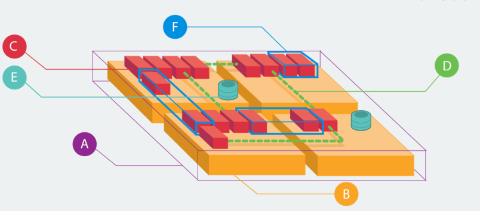

. (A) Node clusters are logical groups of nodes of the same type. Tutum pools your nodes resources, so your apps can run together thereby reducing complexity and waste. Node Clusters can be easily scaled with a drag of the slider.
. (B) Nodes are individual Linux hosts/VMs used to deploy and run your applications. New nodes can be provisioned right from within Tutum to increase the capacity of your Node Clusters.
. (C) Containers, (D) Links and (E) Volumes are Docker concepts.
. (F) Services are logical groups of Docker containers from the same image. Services make it simple to scale your application across different nodes. Simply drag a slider to increase or decrease the availability, performance, and redundancy of your application.

=== Deploy Couchbase Docker Container on Amazon using Tutum

https://support.tutum.co/support/solutions/5000042949[Docker Tutum Getting Started] provides detailed steps on how to get started. Here are the steps that you need to follow to run Couchbase Docker container in Amazon using Docker Tutum.

. Get started for free (at least while its in beta) by https://dashboard.tutum.co/accounts/login/[logging in] using Docker Hub account.
. Link https://support.tutum.co/support/solutions/articles/5000224910-link-your-amazon-web-services-account[Amazon Web Services credentials with Tutum]. I just had to specify Access Key Id and Secret Access Key.If you create a new account for this then you may have to attach a policy to enable privileges such that new instances can be provisioned on your behalf.
. Create a new node cluster at dashboard.tutum.co/node/launch/
+
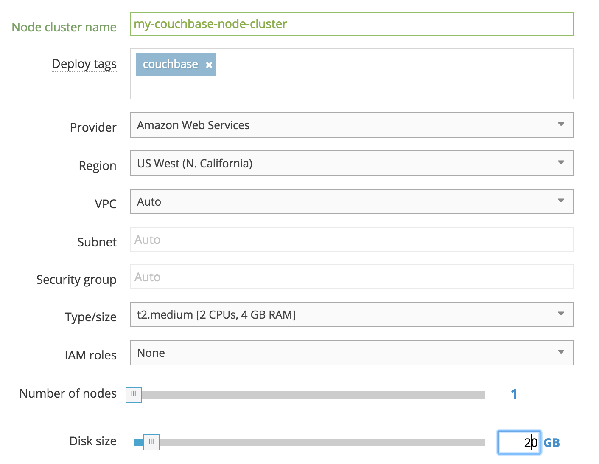
+
The values that need to be specified/changed:
+
.. Node cluster name
.. Deploy tags (optional)
.. Type/size to t2.medium
.. Disk size reduce from 60 to 20 GB (optional)
+
Takes a few minutes to provision the AMI. Updated status could be seen on https://us-west-1.console.aws.amazon.com/ec2/v2/home?region=us-west-1#Instances:sort=instanceId[AWS Console]:
+
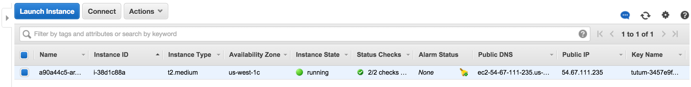
+
Tutum dashboard shows the following status after the node is created: 
+
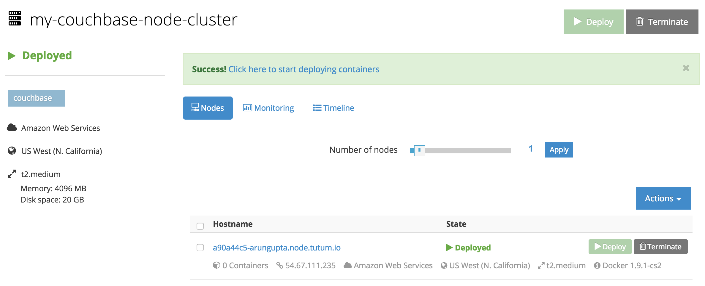
+
. Create your first service at http://dashboard.tutum.co/container/launch/. Select "`Public Repositories`" and search for "`arungupta/couchbase-node`". 
+
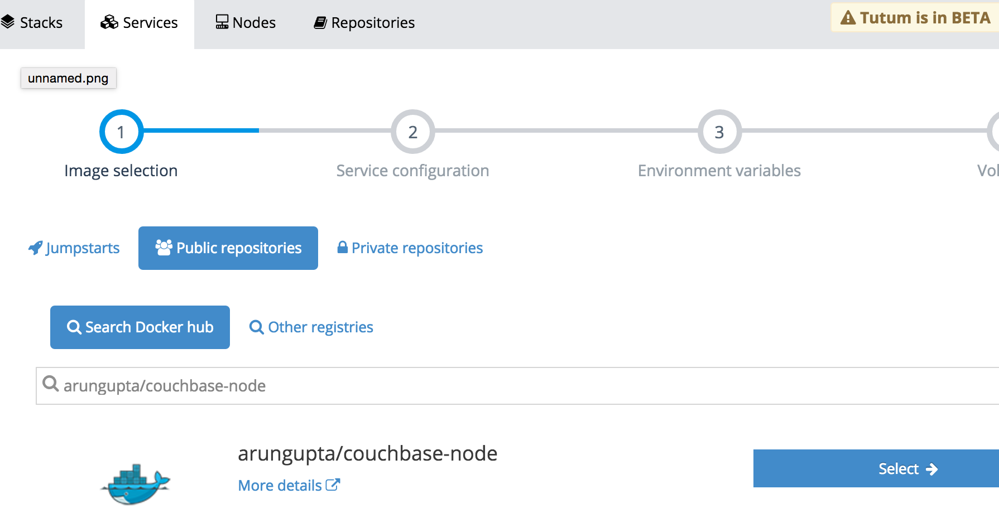
+
This image is created from http://github.com/arun-gupta/docker-images/tree/master/couchbase-node. This image performs the following:
+
.. Starts Couchbase server
.. Configures the server using http://developer.couchbase.com/documentation/server/current/rest-api/rest-endpoints-all.html[Couchbase REST API]
+
. Click on "`Select`" and configure. You only need to override the ports and take all other defaults: 
+
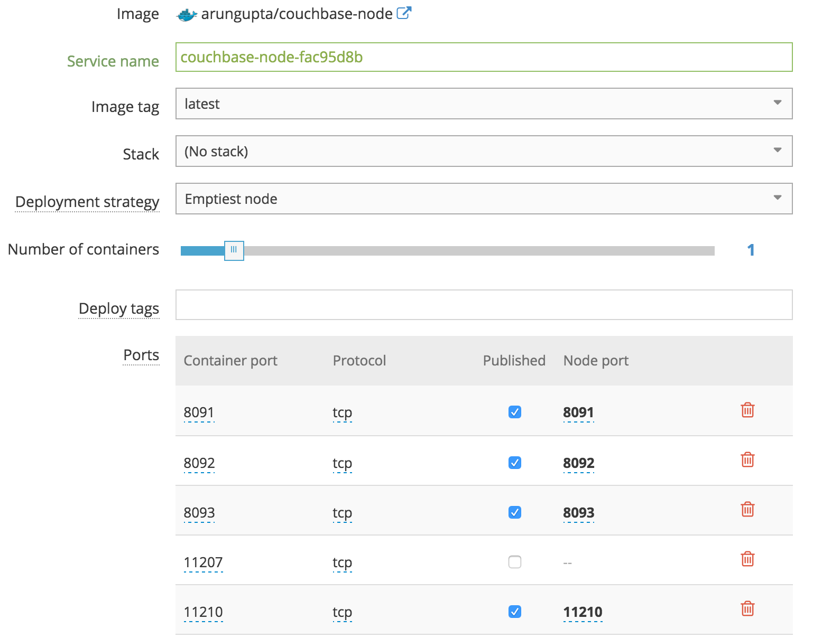
+
Click on "`Create and Deploy`".
+
. Dashboard is updated after the service is deployed:
+
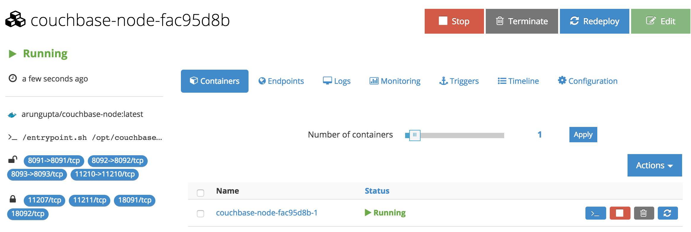
+
. Click on "`Logs`" to see logs from the Couchbase Docker container:
+
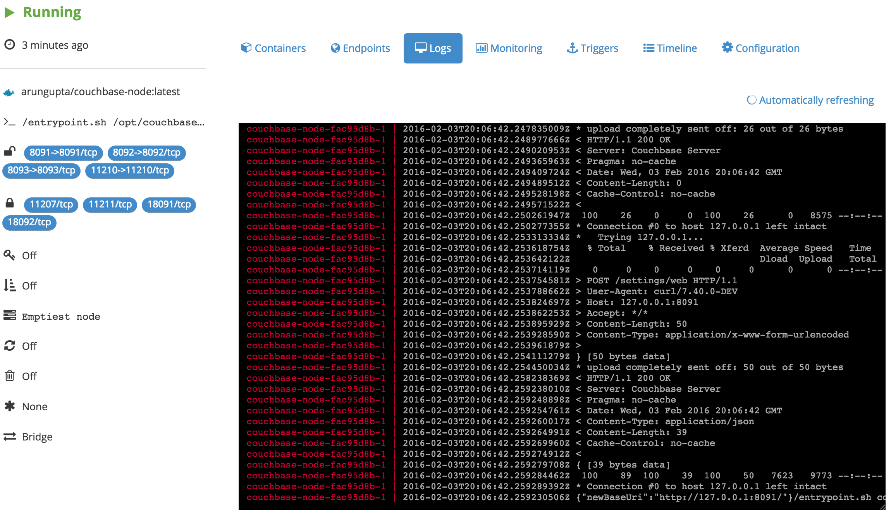
+
. Find IP address from the AWS Console:
+
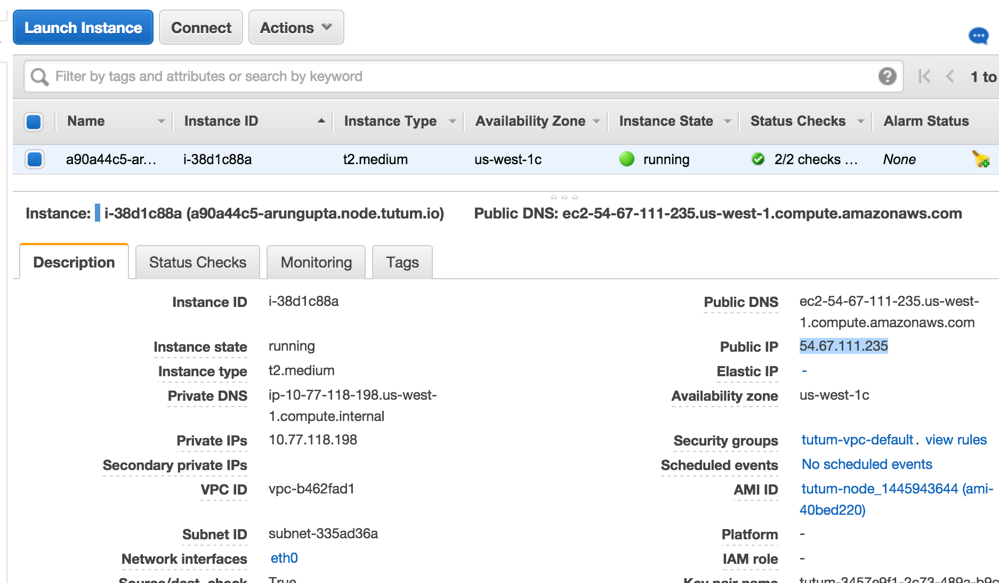
+
. Access Couchbase Console at <IP-ADDRESS>:8091, in our case http://54.67.111.235:8091. This will show the login screen of Couchbase:
+
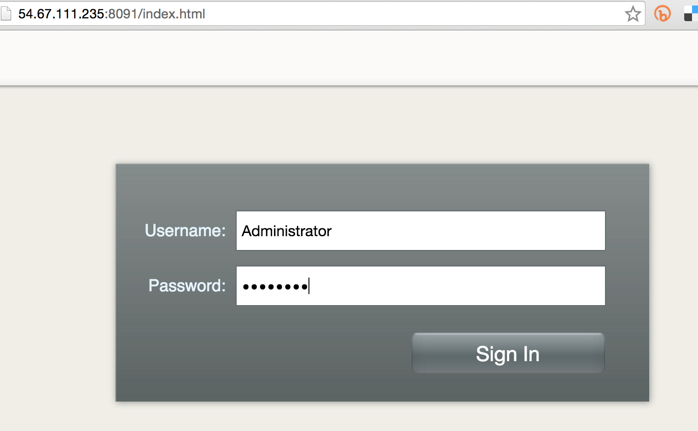
+
Enter the username "`Administrator`" and password "`password`".
+
. This shows the Couchbase Console: 
+
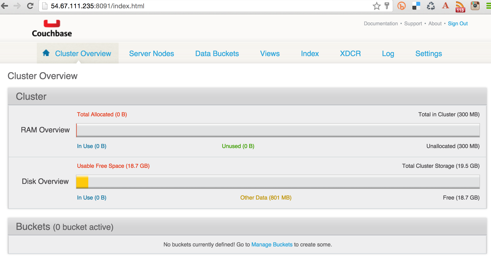

=== Create/Access Sample Bucket on Couchbase

. Click on "`Settings`", "`Sample Buckets`". This shows the list of sample buckets that can be installed.
. Select "`travel-sample`" and click on "`Create`". The updated console looks like: 
+
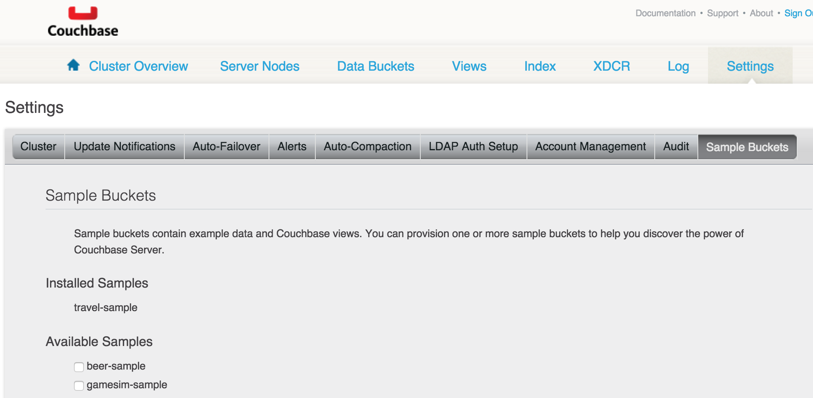
+
. If you've downloaded Couchbase server locally, then you can use http://developer.couchbase.com/documentation/server/current/cli/cbq-tool.html[Couchbase Query CLI Tool] (cbq) to connect and query:
+
[source, text]
----
bin > ./cbq -engine=http://54.67.111.235:8093
Couchbase query shell connected to http://54.67.111.235:8093/ . Type Ctrl-D to exit.
cbq> select * from `travel-sample` limit 1;
{
    "requestID": "aec63fba-a85a-4763-9453-1d7ea0c5409c",
    "signature": {
        "*": "*"
    },
    "results": [
        {
            "travel-sample": {
                "callsign": "MILE-AIR",
                "country": "United States",
                "iata": "Q5",
                "icao": "MLA",
                "id": 10,
                "name": "40-Mile Air",
                "type": "airline"
            }
        }
    ],
    "status": "success",
    "metrics": {
        "elapsedTime": "10.135335ms",
        "executionTime": "10.091507ms",
        "resultCount": 1,
        "resultSize": 300
    }
}
----
+
Couchbase allows to query document database using http://www.couchbase.com/n1ql[SQL-like syntax], aka N1QL.

=== Access Couchbase using Java application

Use instructions from https://github.com/arun-gupta/couchbase-javaee.

