= Docker and Kubernetes for Java Developers
:toc:
:toc-placement!:

## Preface
Containers are enabling developers to package their applications (and underlying dependencies) in new ways that are portable and work consistently everywhere? On your machine, in production, in your data center, and in the cloud. And Docker has become the de facto standard for those portable containers in the cloud.

Docker is the developer-friendly Linux container technology that enables creation of your stack: OS, JVM, app server, app, and all your custom configuration. So with all it offers, how comfortable are you and your team taking Docker from development to production? Are you hearing developers say, “But it works on my machine!” when code breaks in production?

This lab offers developers an intro-level, hands-on session with Docker, from installation, to exploring Docker Hub, to crafting their own images, to adding Java apps and running custom containers. It will also explain how to use Swarm to orchesorchestrate these containers together. This is a BYOL (bring your own laptop) session, so bring your Windows, OSX, or Linux laptop and be ready to dig into a tool that promises to be at the forefront of our industry for some time to come.

toc::[]

## Setup Environments

This section describes the relevant steps for both attendees and instructors to setup the environments. Please follow the parts, that are appropriate for you.

### Instructor

The instructor setup is designed to make the lab most reliable even with bad Internet connections. Most if not all of the software can be directly downloaded from the instructor's machine. The machine is setup as _Docker Host_ and also runs a _Docker Registry_.

Execute https://github.com/arun-gupta/docker-java/tree/master/instructor[instructor setup instructions] at least a day before the lab.

### Attendees

This lab is designed for a BYOL (Brying Your Own Laptop) style hands-on-lab. We did our best to support a wide range of client configurations but only did test on machines as stated in the hardware section.

https://github.com/arun-gupta/docker-java/tree/master/attendees[Download and setup attendee laptop].

## The Lab

### Docker Basics
Docker simplifies software delivery by making it easy to build and share images that contain your application’s entire environment, or application operating system.

**What does it mean by application operating system ?**

Your application typically require a specific version of operating system, application server, JDK, database server, may require to tune the configuration files, and similarly multiple other dependencies. The application may need binding to specific ports and certain amount of memory. The components and configuration together required to run your application is what is referred to as application operating system.

You can certainly provide an installation script that will download and install these components. Docker simplifies this process by allowing to create an image that contains your application and infrastructure together, managed as one component. These images are then used to create Docker containers which run on the container virtualization platform, provided by Docker.

**What can a Java Developer use Docker for?**

. *Faster delivery of your applications*: Docker helps you with the development lifecycle.
Docker allows you to develop on local containers that contain your applications
and services. It can then integrate into a continuous integration and
deployment workflow.
+
For example, you write code locally and share the development stack
via Docker with colleagues. When everybody is ready, you push the
code and the stack you all are developing onto a test environment
and execute any required tests.
+
From the testing environment, you can then push the Docker images
into production and deploy your code.
+
. *Deploying and scaling more easily*: Docker's container-based platform allows for portable workloads. Docker containers can run on a developer's local host, on physical
or virtual machines in a data center, or in the Cloud.
+
Docker's portability and lightweight nature also make dynamically managing workloads easy. You can use Docker to quickly scale up or tear down applications and services. Docker is so fast, that scaling can be near real time.

**How is it different from VM?**

Docker is an open source container virtualization platform.

Docker has three main components:

. __Images__ are *build component* of Docker and a read-only template of application operating system.
. __Containers__ are *run component* of Docker, and created from, images.Containers can be run, started, stopped, moved, and deleted.
. Images are stored, shared, and managed in a __registry__, the *distribution component* of Docker. The publically available registry is known as Docker Hub.

In order for these three components to work together, there is *Docker Daemon* that runs on a host machine and does the heavy lifting of building, running, and distributing Docker containers. In addition, there is *Client* that is a Docker binary which accepts commands from the user and communicates back and forth with the daemon.

.Docker architecture
image::images/docker-architecture.png[]

Client communicates with Daemon, either co-located on the same host, or on a different host. It requests the Daemon to pull an image from the repository using `pull` command. The Daemon then downloads the image from Docker Hub, or whatever registry is configured. Multiple images can be downloaded from the registry and installed on Daemon host. Images are run using `run` command to create containers on demand.

**How does a Docker Image work?**

We've already seen that Docker images are read-only templates from which Docker containers are launched. Each image consists of a series of layers. Docker makes use of union file systems to combine these layers into a single image. Union file systems allow files and directories of separate file systems, known as branches, to be transparently overlaid, forming a single coherent file system.

One of the reasons Docker is so lightweight is because of these layers. When you change a Docker image—for example, update an application to a new version— a new layer gets built. Thus, rather than replacing the whole image or entirely rebuilding, as you may do with a virtual machine, only that layer is added or updated. Now you don't need to distribute a whole new image, just the update, making distributing Docker images faster and simpler.

Every image starts from a base image, for example `ubuntu`, a base Ubuntu image, or `fedora`, a base Fedora image. You can also use images of your own as the basis for a new image, for example if you have a base Apache image you could use this as the base of all your web application images.

NOTE: By default, Docker obtains these base images from Docker Hub.

Docker images are then built from these base images using a simple, descriptive set of steps we call instructions. Each instruction creates a new layer in our image. Instructions include actions like:

. Run a command.
. Add a file or directory.
. Create an environment variable.
. What process to run when launching a container from this image.

These instructions are stored in a file called a Dockerfile. Docker reads this Dockerfile when you request a build of an image, executes the instructions, and returns a final image.

**How does a container work?**

A container consists of an operating system, user-added files, and meta-data. As we've seen, each container is built from an image. That image tells Docker what the container holds, what process to run when the container is launched, and a variety of other configuration data. The Docker image is read-only. When Docker runs a container from an image, it adds a read-write layer on top of the image (using a union file system as we saw earlier) in which your application can then run.

### Docker Machine

Machine makes it really easy to create Docker hosts on your computer, on cloud providers and inside your own data center. It creates servers, installs Docker on them, then configures the Docker client to talk to them.

Once your Docker host has been created, it then has a number of commands for managing them:

. Starting, stopping, restarting
. Upgrading Docker
. Configuring the Docker client to talk to your host

You used Docker Machine already during the attendee setup. We won't need it too much further on. But if you need to create hosts, it's a very handy tool to know about. From now on we're mostly going to use the docker client.
Find out more about the details at the link:https://docs.docker.com/machine/[Official Docker Machine Website]

Check if docker machine is working using the following command:

[source, text]
----
docker-machine -v
----

### Docker Client

The client communicates with the demon process on your host and let's you work with images and containers.

Check if your client is working using the following command:

[source, text]
----
docker -v
----

The most important options you'll be using frequently are:

. `run` - runs a container
. `ps`- lists containers
. `stop` - stops a container

Get a full list of available commands with
[source, text]
----
docker
----

### Running A Pre-Baked WildFly on Docker

The first step in running any application on Docker is to run an image. There are plenty of images available from the official Docker registry (aka link:https://hub.docker.com[Docker Hub]). To run any of them, you just have to ask the Docker Client to run it. The client will check if the image already exists on Docker Host. If it exists then it'll run it, otherwise the host will download the image and then run it.

Let's first check, if there are any images already available:

[source, text]
----
docker images
----

At first, this list ist empty. Now, let's get a plain `jboss/wildfly` image from your instructor's registry:

[source, text]
----
docker pull <INSTRUCTOR_IP>:5000/wildfly
----

Typically, you'll 

You can see, that Docker is downloading the immage with it's different layers.
In a traditional Linux boot, the kernel first mounts the root File System as read-only, checks its integrity, and then switches the whole rootfs volume to read-write mode.
When Docker mounts the rootfs, it starts read-only, as in a traditional Linux boot, but then, instead of changing the file system to read-write mode, it takes advantage of a union mount to add a read-write file system over the read-only file system. In fact there may be multiple read-only file systems stacked on top of each other. We think of each one of these file systems as a layer.
At first, the top read-write layer has nothing in it, but any time a process creates a file, this happens in the top layer. And if something needs to update an existing file in a lower layer, then the file gets copied to the upper layer and changes go into the copy. The version of the file on the lower layer cannot be seen by the applications anymore, but it is there, unchanged.
We call the union of the read-write layer and all the read-only layers a union file system.

.Docker Layers
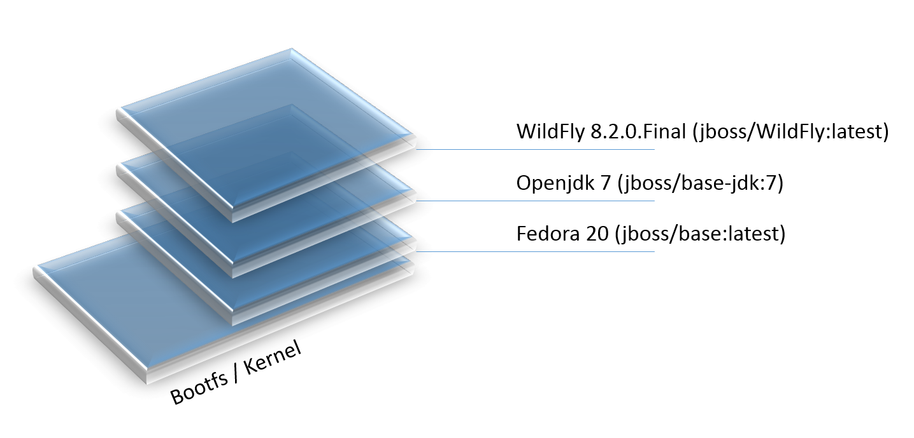

In our particular case, the https://github.com/jboss-dockerfiles/wildfly/blob/master/Dockerfile[jboss/wildfly] image extends the link:https://github.com/jboss-dockerfiles/base/blob/master/Dockerfile[jboss/base-jdk:7] image which adds the OpenJDK distribution on top of the link:https://github.com/jboss-dockerfiles/base/blob/master/Dockerfile[jboss/base] image.
The base image is used for all JBoss community images. It provides a base layer that includes:

. A jboss user (uid/gid 1000) with home directory set to `/opt/jboss`
. A few tools that may be useful when extending the image or installing software, like unzip.

The jboss/base-jdk:7 image adds:

. Latest OpenJDK distribution
. Adds a JAVA_HOME environment variable

When the download is done, you can list the images again and will see the following:

[source, text]
----
docker images

REPOSITORY              TAG     IMAGE ID       CREATED       VIRTUAL SIZE
<INSTRUCTOR_IP>:5000/wildfly  latest  2ac466861ca1   10 weeks ago  951.3 MB

----

Run WildFly in the container:
[source, text]
----
docker run -it <INSTRUCTOR_IP>:5000/wildfly
----

Seems the server started correctly. We can check it by issuing the `docker ps` command which retrieves the images process which are running and the ports engaged by the process:

[source, text]
----
docker ps

CONTAINER ID        IMAGE                  COMMAND                CREATED             STATUS              PORTS               NAMES
48f473979e50        jboss/wildfly:latest   "/opt/jboss/wildfly/   4 minutes ago       Up 4 minutes        8080/tcp            cranky_al
meida
----

If you have noticed the startup log of the server, you should have discovered that the server is located in the `/opt/jboss/wildfly` and that by default the public interfaces are bound to the `0.0.0.0` address whilst the admin interfaces are bound just to localhost. This information will be useful to learn how to customize the server.

So, in order to access to WildFly server, we need to know which address has been chosen by the application server for socket binding. We will use the docker inspect command passing as parameter the ID of the running Container we have already found (48f473979e50):

[source, text]
----
docker inspect --format "{{.NetworkSettings.IPAddress}}" 48f473979e50
----

The above command outputs an IP address (maybe 172.17.0.1) That means, the server is available at the 172.17.0.1 IP Address. 

Now let's open the console at that address: http://172.17.0.1:8080

That did not work. You'll get a ``This webpage is not available - ERR_CONNECTION_TIMED_OUT'' error.

But why?

Docker runs all containers in the host, which is running in a guest system.

When Docker starts, it creates a virtual interface named ``docker0'' on the host machine. It randomly chooses an address and subnet from the private range defined by RFC 1918 that are not in use on the host machine, and assigns it to docker0. Docker made the choice 172.17.0.1 in this example.

But ``docker0'' is no ordinary interface. It is a virtual Ethernet bridge that automatically forwards packets between any other network interfaces that are attached to it. This lets containers communicate both with the host machine and with each other. But nothing more.

Speaking, by default Docker containers can make connections to the outside world, but the outside world cannot connect to containers. This get's another layer of indirection, if you are using boot2docker on for example Mac or Windows. In this case, we don't even care for the Docker generated IP address, but want to know the address, the host is running at.

`docker-machine ip` gives us the host IP address and this was already added to the hosts file. So, we can give it another try by accessing: http://dockerhost:8080.
This will not work either.

If you want containers to accept incoming connections, you will need to provide special options when invoking `docker run`. The container, we just started, can't be accessed by our browser. We need to stop it again and restart with different options.

[source, text]
----
docker stop 48f473979e50
----

Now let's make sure, we're exposing the correct port, that we want to access during startup:

[source, text]
----
docker run -it -p 8080:8080 <INSTRUCTOR_IP>:5000/wildfly
----

The format is `-p hostPort:containerPort`.

Now we're ready to test http://dockerhost:8080 again. This works with the exposed port, as expected.

.Welcome WildFly
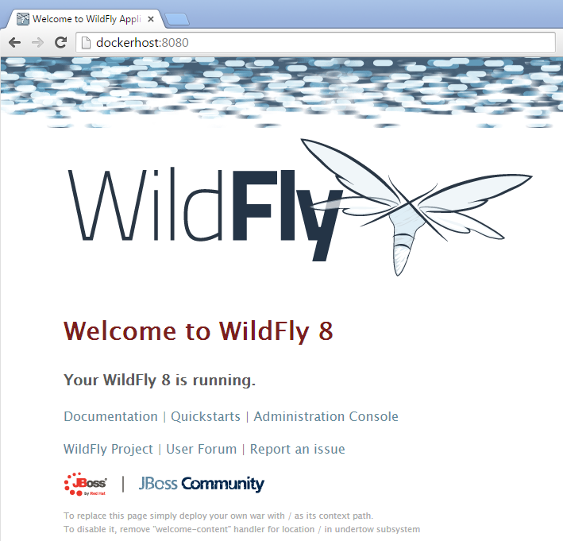

### Running the Java EE 7 Samples

link:https://github.com/javaee-samples/javaee7-hol[Java EE 7 Hands-on Lab] has been delivered all around the world and is a pretty standard application that shows design patterns and anti-patterns for a typical Java EE 7 application.
Docker containers allows you to simplify application delivery by packaging all the key components together in an image. So how do you get the first feel of this Java EE 7 application with Docker ?

Pull the Docker image that contains WildFly and pre-built Java EE 7 application WAR file as shown:

[source, text]
----
docker pull <INSTRUCTOR_IP>:5000/javaee7-hol
----

The javaee7-hol link:https://github.com/arun-gupta/docker-images/blob/master/javaee7-hol/Dockerfile[Dockerfile] is based on `jboss/wildfly` and adds the movieplex7 application as war file.

Run it as:

[source, text]
----
docker run -it -p 8080:8080 arungupta/javaee7-hol
----

See the application in action at http://dockerhost:8080/movieplex7/

### Ticket Monster

TicketMonster is an example application that focuses on Java EE6 - JPA 2, CDI, EJB 3.1 and JAX-RS along with HTML5 and jQuery Mobile. It is a moderately complex application that demonstrates how to build modern web applications optimized for mobile & desktop. TicketMonster is representative of an online ticketing broker - providing access to events (e.g. concerts, shows, etc) with an online booking application.

Apart from being a demo, TicketMonster provides an already existing application structure that you can use as a starting point for your app. You could try out your use cases, test your own ideas, or, contribute improvements back to the community.

.TicketMonster architecture
image::images/ticket-monster_tutorial_architecture.png[]

The application uses Java EE 6 services to provide business logic and persistence, utilizing technologies such as CDI, EJB 3.1 and JAX-RS, JPA 2. These services back the user-facing booking process, which is implemented using HTML5 and JavaScript, with support for mobile devices through jQuery Mobile.

The administration site is centered around CRUD use cases, so instead of writing everything manually, the business layer and UI are generated by Forge, using EJB 3.1, CDI and JAX-RS. For a better user experience, Twitter Bootstrap is used.

Monitoring sales requires staying in touch with the latest changes on the server side, so this part of the application will be developed in HTML5 and JavaScript using a polling solution.

#### Build Ticket Monster

First thing, you're going to do is to build the application from source. Create a directory for the source and change to it:

[source, text]
----
mkdir docker-java/
cd docker-java/
----

And checkout the sources from the instructor git repository.

[source, text]
----
git clone -b WildFly-docker-test http://root:dockeradmin@<INSTRUCTOR_IP>:10080/root/ticket-monster.git
----

`-b WildFly-docker-test` is a branch of Ticket Monster that contains a ``docker-test'' profile to run Arquillian Cube test. More on this later.

From here, you're free to explore the application a bit. Open it with JBDS and find more background about the use-cases and how the application is designed at the link:http://www.jboss.org/ticket-monster/whatisticketmonster/[Ticket Monster Website].

Copy the Maven lab-settings.xml file that you have downloaded from the instructor machine and place it inside `docker-java` directory.

When you're ready, it is time to build the application. Switch to the checkout directory and run maven package.

[source, text]
----
cd docker-java/
mvn -s lab-settings.xml -f ticket-monster/demo/pom.xml -Ppostgresql clean package
----

NOTE: Make sure you've changed <INSTRUCTOR_IP> to the IP address of instructor's machine.

Congratulations! You just build the applications war file. Let's see if this can be deployed.

#### Run Ticket Monster For The First Time

The application needs two things from an infrastructure perspective. A WildFly application server and a Postgress Database. Let Docker do the magic for us.

Check if your docker host is running

[source, text]
----
docker-machine ls
----

You should see the output similar to:

[source, text]
----
NAME        ACTIVE   DRIVER       STATE     URL                         SWARM
lab                  virtualbox   Running   tcp://192.168.99.101:2376   
----

If the machine state is stopped, start it with:

[source, text]
----
docker-machine start lab
----

After it is started you can find out about the IP address of your host with

[source, text]
----
docker-machine ip lab
----

We already did this during the setup document, remember? So, this is a good chance to check, if you already added this IP to your hosts file.

Type:

[source, text]
----
ping dockerhost
----

and see if this resolves to the IP address that the docker-machine command printed out. You should see an output as:

[source, text]
----
> ping dockerhost
PING dockerhost (192.168.99.101): 56 data bytes
64 bytes from 192.168.99.101: icmp_seq=0 ttl=64 time=0.394 ms
64 bytes from 192.168.99.101: icmp_seq=1 ttl=64 time=0.387 ms
----

If it does, you're ready to start over with the lab. If it does not, make sure you've followed the steps to https://github.com/arun-gupta/docker-java/tree/master/attendees#configure-host[configure your host].

Let's get started with the real work.

Time to bring in WildFly and a database. You'll start with the database. Postgres is used as the database for Ticketmonster application.

[source, text]
----
docker run --name db -d -p 5432:5432 -e POSTGRES_USER=ticketmonster -e POSTGRES_PASSWORD=ticketmonster-docker <INSTRUCTOR_IP>:5000/postgres
----
This command starts a container named "db" from the image in your instructor's registry "<INSTRUCTOR_IP>:5000/postgres". As this will not be present locally, it needs to be downloaded first. But you'll have a very quick connection to the instructor registry and this shouldn't take long.
The two "-e" options define environment variables which are read by the db at startup and allow us to access the database with this user and password.
Finally, the "-d" option tells docker to start a demon process. Which means, that the console window, you're running this command in, will be available again after it is issued. If you skip this parameter, the console will be directly showing the output from the process.
"-p" option maps container ports to host ports and allows other containers on our host to access them.

.More Information about port mapping
[NOTE]
===============================
Port exposure and mapping are the keys to successful work with Docker.
See more about networking on the Docker website link:https://docs.docker.com/articles/networking/[Advanced Networking]
===============================

This should have worked. To double check if it did, you can see the server logs
[source, text]
----
docker logs -f db
----
The "-f" flag keeps refreshing the logs and pushes new events directly out to the console.

After the database server is up and running we now need the WildFly.
[source, text]
----
docker run -d --name wildfly -p 8080:8080 --link db:db -v /Users/youruser/tmp/deployments:/opt/jboss/wildfly/standalone/deployments/:rw <INSTRUCTOR_IP>:5000/wildfly
----
This command starts a container named "wildfly" and links this container to the db (--link option) container we started earlier.

.More Information about container linking
[NOTE]
===============================
You saw how you can connect to a service running inside a Docker container via a network port. But a port connection is only one way you can interact with services and applications running inside Docker containers.
Docker also has a linking system that allows you to link multiple containers together and send connection information from one to another. When containers are linked, information about a source container can be sent to a recipient container. This allows the recipient to see selected data describing aspects of the source container.
See more about container communication on the Docker website link:https://docs.docker.com/userguide/dockerlinks/[Linking Containers Together]
===============================

The "-v" flag maps a local directory into the host. This will be the place to put the deployments. Please make sure to use `-v /c/Users/` notation for drive letters on windows.
The other options are known to you already.
Check the logs if the server is started.

[source, text]
----
docker logs -f wildfly
----

And access the http://dockerhost:8080 with your webbrowser to make sure the instance is up and running.

Now you're ready to deploy the application for the first time. Let's use JBoss Developer Studio for this.

## Deploy an application from JBoss Developer Studio

Start JDBS if not started. And create a server adaptor first.

.Server adapter
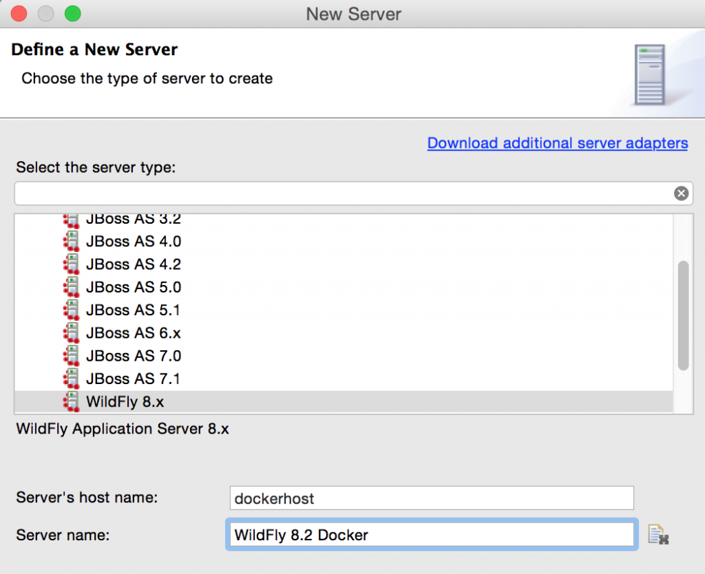

Assign or create a WildFly 8.x runtime (Changed properties are highlighted.)

.WildFly Runtime Properties
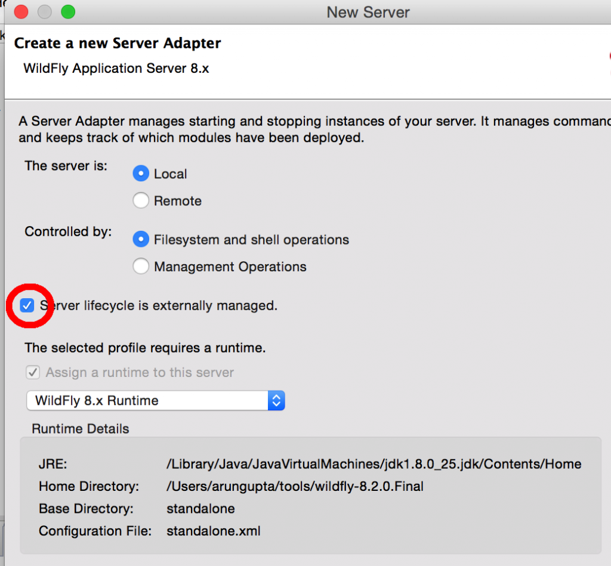

Setup the server properties in the following image.  The two properties on the left are automatically propagated from the previous dialog. Additional two properties on the right side are required to disable to keep deployment scanners in sync with the server.

.Server properties
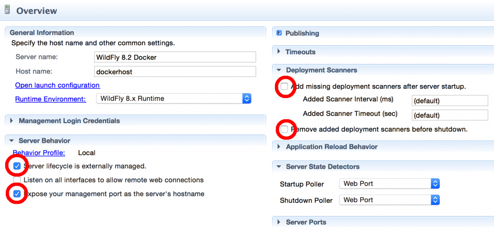

Specify a custom deployment folder on Deployment tab of Server Editor

.Server Editor
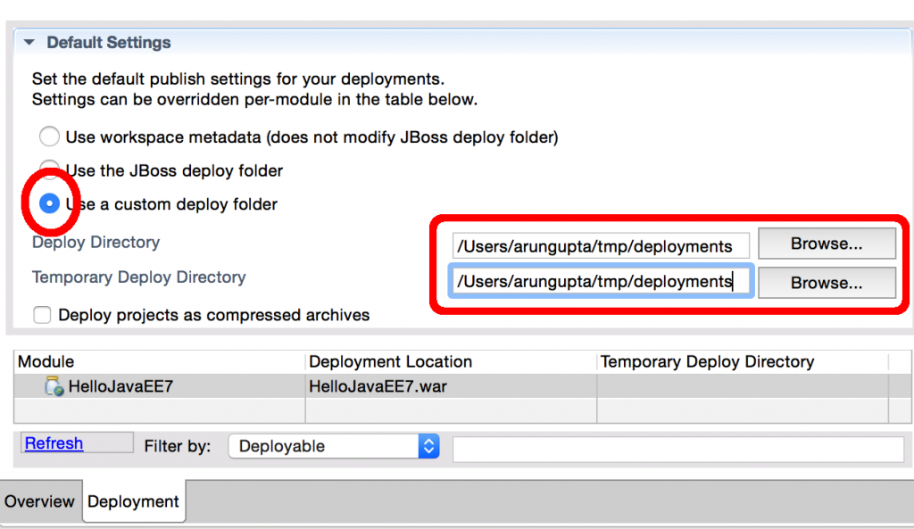

Right-click on the newly created server adapter and click “Start”.

.Start Server
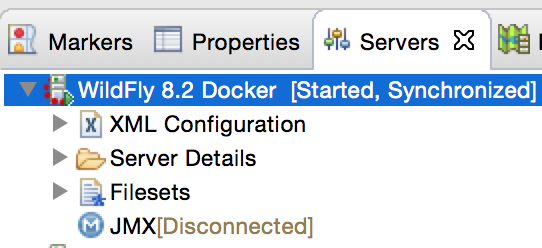

Now you need to right-click, Run on Server on the ticket-monster application and chose this server.
The project runs and displays the start page of ticket-monster

.Start Server
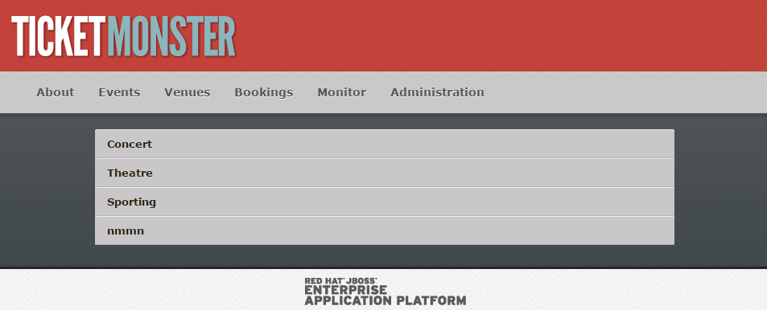

Congratulations! You've just deployed your first application to a WildFly running in a Docker container.

Stop wildfly when you're done.
[source, text]
----
docker stop wildfly
----

### Other Deployment options
For the first deployment we used a shared volumen on the host computer. Let's explore deeper, what other deployment options we have

**Using the CLI**

The Command Line Interface (CLI) is a tool for connecting to WildFly instances to manage all tasks from command line environment. Some of the tasks that you can do using the CLI are:

. Deploy/Undeploy web application in standalone/Domain Mode.
. View all information about the deployed application on runtime.
. Start/Stop/Restart Nodes in respective mode i.e. Standalone/Domain.
. Adding/Deleting resource or subsystems to servers.

In order to work with the CLI you need to have it locally installed on your machine. Your instructor has a download prepared for you at http://<INSTRUCTOR_IP:8082>/downloads/
Unzip into a folder of your choice (e.g. /Users/arungupta/WildFly82/). This folder is named $WIDLFY_HOME from here on. Make sure to add the /Users/arungupta/WildFly82/bin to your path environment variable.

[source, text]
----
# Windows Example
set PATH=%PATH%;%WILDFLY_HOME%/bin
----

Now run the `jboss-cli` command and connect to the running WildFly instance.

[source, text]
----
cd %WIDLFY_HOME%/bin
./jboss-cli.sh --controller=dockerhost:9990  -u=admin -p=docker#admin -c
----

Once that you're connected through the `jboss-cli`, run:

[source, text]
----
deploy <TICKET_MONSTER_PATH>/ticket-monster.war --force
----

Now you've been sucessfully using the CLI to remotely deploy the ticket-monster application to a running docker container.
And again, keep the container running, we're going to look into the last deployment option you have.

**Using the web console**

The build in Web-Console also relies on the same management APIs that we've already been using via JBoss Developer Tools and the CLI. It does provide a nice web-based way to administrate your instance and if you've already exposed the container ports, you can simply access it via the URL: http://dockerhost:9990 in your webbrowser.
This will point you to the management interface

.The Web Console
image::images/console1.png[]

If you're prompted for username and password enter "admin" as username and "docker#admin" as password. Now navigate through it and execute the following steps:

. Go to the "Deployments tab".
. Click on "Replace" button.
. On the "Step 1/2" screen, select the <TICKET_MONSTER_PATH>/ticket-monster.war file on your computer and click "Next".
. On the "Step 2/2" screen, click "Next" again.

Now you've been successfully deploying the Ticket Monster application in three different ways. Time to look at some more features, that Docker can provide to Java developers.

Keep the WildFly instance up and running this time. We will re-use it for the next deployment option.

**Deployment to WildFly Container using Management API (Optional Task if you have time)**

A standalone WildFly process, process can be configured to listen for remote management requests using its "native management interface".
The CLI tool that comes with the application server uses this interface, and user can develop custom clients that use it as well. In order to use this, the wildfly management interface listen IP needs to be changed from 127.0.0.1 to 0.0.0.0 which basically means, that it is not only listening on the localhost but also on all publicly assigned IP addresses.

The database server is still up an running. Now we're starting another WildFly instance again:
[source, text]
----
docker run -d --name wildflymngm -p 8080:8080 -p 9990:9990 --link db:db <INSTRUCTOR_IP>:5000/wildfly-management
----
As you can see, there is no mapped volume in this case but an additional port exposed. The WildFly image that is used makes ist easier for you to play around with the deployment via the management API. It has a tweaked start script which changes the management interface according to the behavior described in the first sentence.
Now go and create another new server adapter in JBoss Developer Studio.

.Create New Server Adapter
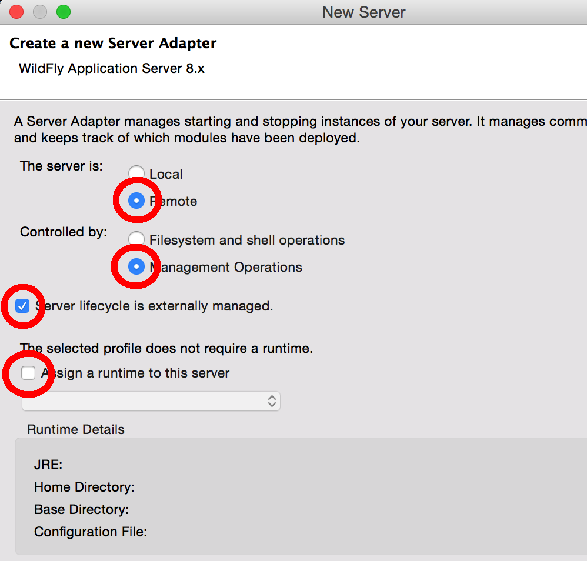

Keep the defaults in the adapter properties.

.Adapter Properties
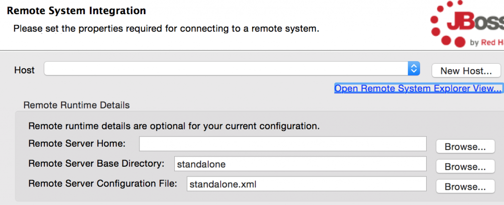

Set up server properties by specifying the admin credentials (Admin#70365). Note, you need to delete the existing password and use this instead:

.Management Login Credentials
image::images/jbds9.png[]

Right-click on the newly created server adapter and click “Start”.Status quickly changes to “Started, Synchronized” as shown.

.Start Server
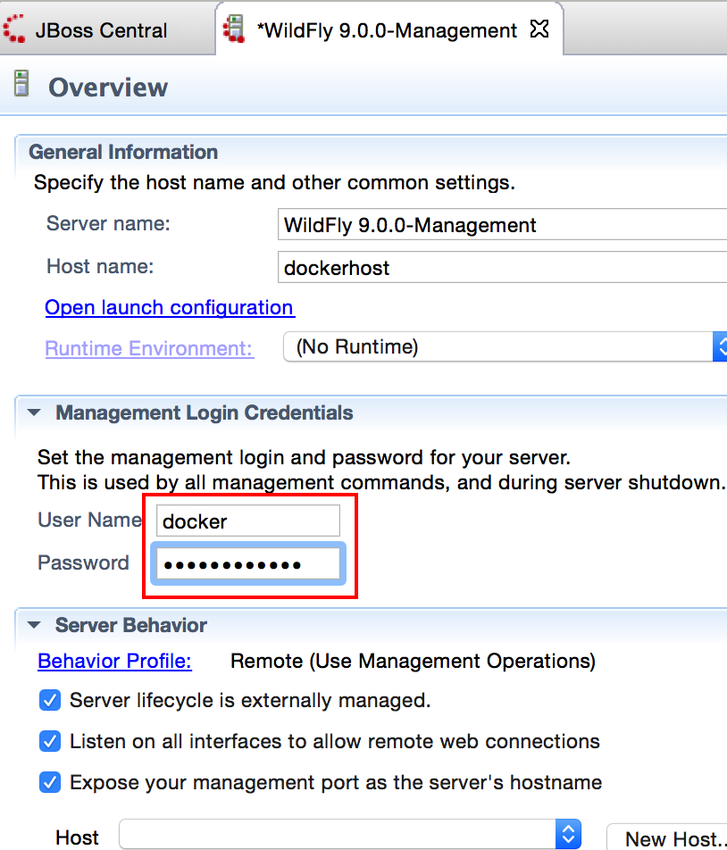

Now you need to right-click, Run on Server on the ticket-monster application and chose this server.
The project runs and displays the start page of ticket-monster.

Stop wildfly when you're done.
[source, text]
----
docker stop wildflymngm
----

### Add the Docker Tools To JBoss Developer Studio
The Docker tooling is aimed at providing at minimum the same basic level features as the command-line interface, but also provide some advantages by having access to a full fledged UI.
As this is still in early access stage, you will have to install it first:

. Open JDBS
. Add a new site using the  command link Install/Update > Available Software Sites preference page.
. Use the URL http://download.eclipse.org/linuxtools/updates-docker-nightly/
. Name it Docker-Nightly
. Select "Docker Tooling" form the Linux Tools and click next.

.Add Docker Tooling To JDBS
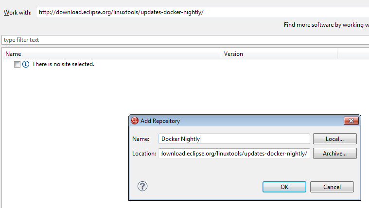

**Docker Explorer**

The Docker Explorer provides a wizard to establish a new connection to a Docker daemon. This wizard can detect default settings if the user’s machine runs Docker natively or in a VM using Boot2Docker. Both Unix sockets on Linux machines and the REST API on other OSes are detected and supported. The wizard also allows remote connections using custom settings.

.The Docker Explorer
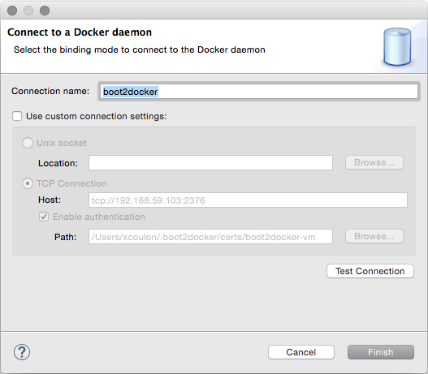

The Docker Explorer itself is a tree view that handles multiple connections and provides users with quick overview of the existing images and containers.

.The Docker Explorer Tree View
image::images/jdbs-docker-tools3.png[]

Built-in filters can show/hide intermediate and 'dangling' images as well as stopped containers.

**Managing Docker Images**

The Docker Images view lists all images in the Docker host selected in the Docker Explorer view. This view allows user to manage images, including:

. Pulling images from the Docker Hub Registry (other registries will be supported as well)
. Uploading images to the Docker Hub Registry
. Building images from a Dockerfile
. Creating a container from an image

.Docker Images View
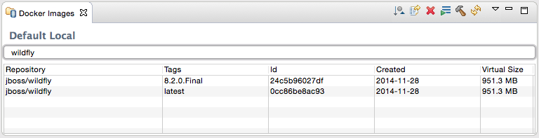

A wizard lets the user input all the arguments to create a new container from an image. When the container is started, all the logs can be streamed into the Eclipse Console:

.Streaming Logs
image::images/jdbs-docker-tools5.png[]

**Managing Docker Containers**

The Docker Containers view lets the user manage her containers. The view toolbar provides commands to start, stop, pause, unpause, display the logs and kill containers.

.Docker Containers View
image::images/jdbs-docker-tools6.png[]

This view also provides a filter to show/hide stopped containers. Users can also attach an Eclipse console to a running Docker container to follow the logs and use the STDIN to interact with it.

**Info and Inspect on Images and Containers**

We also integrate with the Eclipse Properties view to provide users with info and 'inspect' data about a selected container or image.

.Eclipse Properties View
image::images/jdbs-docker-tools7.png[]

## Ticket-Monster Docker Cluster
Another frequent requirement for Java EE based applications is clustering. While setup and test can be complicated on developer machines, this is where Docker can play to it's full potential. With the help of images and automatic port mapping, we're ready to test Ticket-Monster on a couple of WildFly instances and add and remove them randomly.
Here is the rough architecture, of what we're going to do:

.Standalone Cluster with WildFly and mod_cluster
image::images/wildfly_cluster1.png[]

We're going to start with the Apache HTTPD server.
[source, text]
----
docker run -d --name modcluster -p 80:80 <INSTRUCTOR_IP>:5000/mod_cluster
----

To see if everything worked out the way we wanted it, open http://dockerhost/mod_cluster_manager with your browser. This should show the empty console:

.Apache HTTPD runing mod_cluster_manager interface
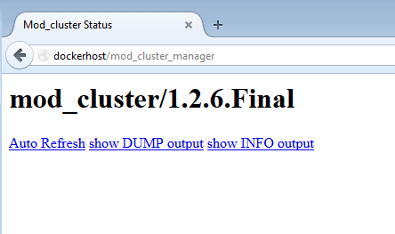

Now we need the first WildFly instance:

[source, text]
----
docker run -d --name server1 --link db:db --link modcluster:modcluster <INSTRUCTOR_IP>:5000/ticketmonster-pgsql-wildfly
----

You do already know the command syntax. Beside linking the db, we also link the modcluster container. This should be done very quickly and if you now revisit link:http://dockerhost/mod_cluster_manager/[the mod_cluster_manager] website in your browser, you can see, that the first server was registered to the loadbalancer:

.Loadbalancer registered first WildFly instance.
image::images/wildfly_cluster3.png[]

To make sure the Ticket Monster App is also running just visit http://dockerhost/ticket-monster and you will be presented with the ticket monster welcome screen.

.Clustered Ticket Monster Application
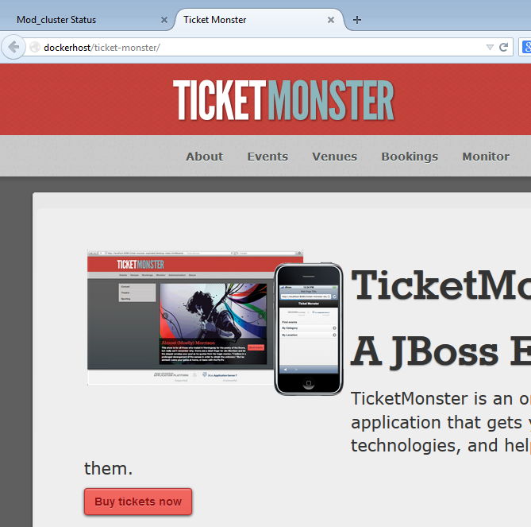

You can now start as many wildfly instances you want (and your computer memory can handle):
[source, text]
----
docker run -d --name server2 --link db:db --link modcluster:modcluster <INSTRUCTOR_IP>:5000/ticketmonster-pgsql-wildfly
docker run -d --name server3 --link db:db --link modcluster:modcluster <INSTRUCTOR_IP>:5000/ticketmonster-pgsql-wildfly
docker run -d --name server4 --link db:db --link modcluster:modcluster <INSTRUCTOR_IP>:5000/ticketmonster-pgsql-wildfly
----

You can stop some servers and check the application behavior:
[source, text]
----
docker stop server1
docker stop server3

----

TODO: Pick, which parts we want to describe in more detail from here: https://goldmann.pl/blog/2013/10/07/wildfly-cluster-using-docker-on-fedora/

## Test Java EE Applications on Docker
Testing Java EE applications is a very important aspect. Especially when it comes to in-container tests, link:http://www.arquillian.org[JBoss Arquillian] is well known to make this very easy.
Picking up where unit tests leave off, Arquillian handles all the plumbing of container management, deployment and framework initialization so you can focus on the task at hand, writing your tests. Real tests.

Arquillian brings the test to the runtime so you don’t have to manage the runtime from the test (or the build). Arquillian eliminates this burden by covering all aspects of test execution, which entails:

. Managing the lifecycle of the container (or containers)
. Bundling the test case, dependent classes and resources into a ShrinkWrap archive (or archives)
. Deploying the archive (or archives) to the container (or containers)
. Enriching the test case by providing dependency injection and other declarative services
. Executing the tests inside (or against) the container
. Capturing the results and returning them to the test runner for reporting
. To avoid introducing unnecessary complexity into the developer’s build environment, Arquillian integrates seamlessly with familiar testing frameworks (e.g., JUnit 4, TestNG 5), allowing tests to be launched using existing IDE, Ant and Maven test plugins — without any add-ons.

Basically, you can just use Arquillian with the link:http://arquillian.org/modules/wildfly-arquillian-wildfly-remote-container-adapter/[WildFly Remote container adapter] and connect to any WildFly instance running in a Docker container. But this wouldn't help with the Docker container lifycycle management.
This is where a new Arquillian extension, named link:http://arquillian.org/blog/2014/11/17/arquillian-cube-1-0-0-Alpha1/["Cube"] comes in.
With this extension you can start a Docker container with a server installed, deploy the required deployable file within it and execute Arquillian tests.

The key point here is that if Docker is used as deployable platform in production, your tests are executed in a the same container as it will be in production, so your tests are even more real than before.

[source, text]
----
mvn -s settings.xml -f ticket-monster/demo/pom.xml -Pdocker-test test
----

http://blog.arungupta.me/run-javaee-tests-wildfly-docker-arquillian-cube/

## Cluster using Swarm
One of the key updates as part of Docker 1.6 is Docker Swarm 0.2.0. Docker Swarm solves one of the fundamental limitations of Docker where the containers could only run on a single Docker host. Docker Swarm is native clustering for Docker. It turns a pool of Docker hosts into a single, virtual host.

.Key Components of Docker Swarm
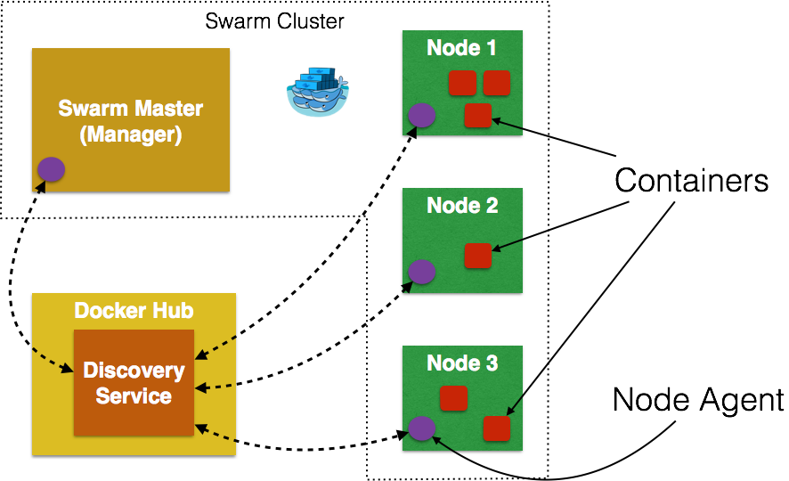

**Swarm Manager:** Docker Swarm has a Master or Manager, that is a pre-defined Docker Host, and is a single point for all administration. Currently only a single instance of manager is allowed in the cluster. This is a SPOF for high availability architectures and additional managers will be allowed in a future version of Swarm with #598.

**Swarm Nodes:** The containers are deployed on Nodes that are additional Docker Hosts. Each Swarm Node  must be accessible by the manager, each node must listen to the same network interface (TCP port). Each node runs a node agent that registers the referenced Docker daemon, monitors it, and updates the discovery backend with the node’s status. The containers run on a node.

**Scheduler Strategy:** Different scheduler strategies (binpack, spread, and random) can be applied to pick the best node to run your container. The default strategy is spread which optimizes the node for least number of running containers. There are multiple kinds of filters, such as constraints and affinity.  This should allow for a decent scheduling algorithm.

**Node Discovery Service:** By default, Swarm uses hosted discovery service, based on Docker Hub, using tokens to discover nodes that are part of a cluster. However etcd, consul, and zookeeper can be also be used for service discovery as well. This is particularly useful if there is no access to Internet, or you are running the setup in a closed network. A new discovery backend can be created as explained here. It would be useful to have the hosted Discovery Service inside the firewall and #660 will discuss this.

**Standard Docker API:** Docker Swarm serves the standard Docker API and thus any tool that talks to a single Docker host will seamlessly scale to multiple hosts now. That means if you were using shell scripts using Docker CLI to configure multiple Docker hosts, the same CLI would can now talk to Swarm cluster and Docker Swarm will then act as proxy and run it on the cluster.

There are lots of other concepts but these are the main ones.

First thing to do is, to create a Swarm cluster. The easiest way of using Swarm is, by using the official Docker image:

[source, text]
----
docker run swarm create
----

This command returns a <TOKEN> and is the unique cluster id. It will be used when creating master and nodes later. This cluster id is returned by the hosted discovery service on Docker Hub.

NOTE: Make sure to note this cluster id now as there is no means to list it later.

Swarm is fully integrated with Docker Machine, and so is the easiest way to get started. Let's create a Swarm Master next:

[source, text]
----
docker-machine create -d virtualbox --swarm --swarm-master --swarm-discovery token://<TOKEN> swarm-master
----

The option "--swarm" configures the machine with Swarm, "--swarm-master" configures the created machine to be Swarm master. Make sure to replace cluster id after token:// with that obtained in the previous step. Swarm master creation talks to the hosted service on Docker Hub and informs that a master is created in the cluster.

Now connect to this newly created master and find some more information about it:

[source, text]
----
eval "$(docker-machine env swarm-master)"
docker info
----

_NOTE: If you're on Windows, use the "docker-machine env swarm-master" command only and copy the output into an editor to replace all appearances of EXPORT with SET and issue the three commands at your command prompt, remove the quotes and all duplicate appearences of "/" _

Looks, like everything is working fine. Now we need the Swarm nodes.

[source, text]
----
docker-machine create -d virtualbox --swarm --swarm-discovery token://<TOKEN> swarm-node-01
----

Node creation talks to the hosted service at Docker Hub and joins the previously created cluster. This is specified by --swarm-discovery token://... and specifying the cluster id obtained earlier.

To make it a real cluster, let's just create a second node:

[source, text]
----
docker-machine create -d virtualbox --swarm --swarm-discovery token://<TOKEN> swarm-node-02
----

And list all the nodes / Docker machines, that has been created so far.
The machines that are part of the cluster have the cluster’s name in the SWARM column, blank otherwise. For example, mymachine is a standalone machine where as all other machines are part of swarm-master cluster. The Swarm master is also identified by (master) in the SWARM column.

Connect to the Swarm cluster and find some information about it:

[source, text]
----
eval "$(docker-machine env --swarm swarm-master)"
docker info
----

There are 3 nodes – one Swarm master and 2 Swarm nodes. There is a total of 4 containers running in this cluster – one Swarm agent on master and each node, and there is an additional swarm-agent-master running on the master. This can be verified by connecting to the master and listing all the containers:

[source, text]
----
eval "$(docker-machine env swarm-master)"
docker info
----

List the nodes in the cluster with the following command:

[source, text]
----
docker run swarm list token://<TOKEN>
----

The complete cluster is in place now, and we need to deploy the Ticket Monster application to it.
Swarm takes care for the distribution of the deployments across the nodes. The only thing, we need to do is to deploy the application as explained already:

Double check, if the db instance is still running. If not, start it again.

[source, text]
----
docker start db
----

Next is the modcluster container:

[source, text]
----
docker start modcluster
----

And finally the server instances 1 to 3:

[source, text]
----
docker start server1
docker start server2
docker start server3
----

## OpenShift v3 (Optional Part, No Windows )
If you are on a Mac or Linux system, you can also try out clustering with OpenShift V3 and Kubernetes. For this is an optional step in the lab, you can follow these separate instructions.

http://blog.arungupta.me/openshift-v3-getting-started-javaee7-wildfly-mysql/

## Docker Compose (Optional, No Windows Version without Python)
Docker Orchestration using Fig showed how to defining and control a multi-container service using Fig. Since then, Fig has been renamed to Docker Compose, or Compose for short.
If you have some additional time, you can take this part of the lab:

http://blog.arungupta.me/docker-compose-orchestrate-containers-techtip77/

## References

. JBoss and Docker: http://www.jboss.org/docker/
